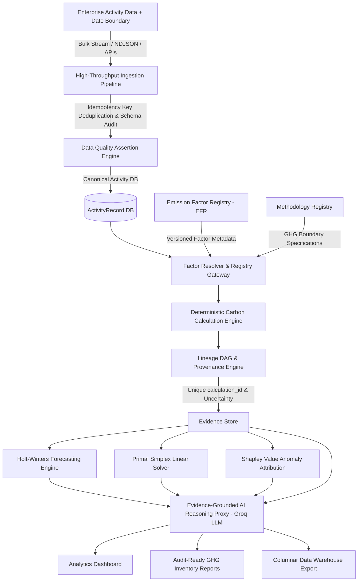
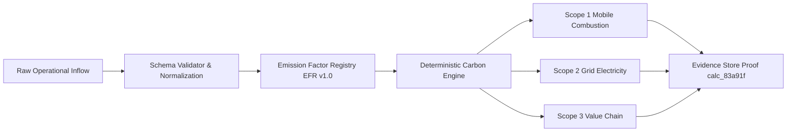

<h1 align="center">Carbonly</h1>

<p align="center">
  <strong>Auditable Carbon Intelligence &amp; Enterprise Decarbonization Platform</strong>
</p>

<p align="center">
  <a href="https://carbonlyai.netlify.app/"><strong>🌐 Live Production Web App</strong></a> &nbsp;|&nbsp;
  <a href="https://carbonly-qpet.onrender.com/health"><strong>⚡ Live Backend API Gateway</strong></a>
</p>

<p align="center">
  An enterprise-grade ESG accounting platform providing deterministic GHG Protocol calculations across Scope 1, Scope 2, and Scope 3, versioned emission factor registries, calculation provenance lineage, uncertainty propagation, Holt-Winters triple exponential smoothing with genuine Train/Test out-of-sample holdout evaluation, Primal Simplex linear programming optimization, Shapley value attribution with facility load synergy scaling, and evidence-grounded AI decision intelligence.
</p>

---

## 1. Executive Summary & Core Architectural Philosophy

Carbonly is an auditable carbon data and decarbonization decision platform: it converts corporate activity data into traceable GHG inventories, quantifies data confidence and uncertainty, identifies operational emission drivers via Shapley value game theory, forecasts future trajectories via Holt-Winters exponential smoothing, and optimizes decarbonization investments via Primal Simplex linear programming—with AI providing a grounded decision interface over verified evidence.

### Enterprise Data Engineering & Mathematical Capabilities:
- **High-Throughput Batch Ingestion & Idempotency Pipeline**: Bulk stream ingestion via NDJSON/CSV APIs (`/api/carbon/batch-ingest`) with strict idempotency key deduplication (`idempotencyKey`).
- **Data Quality & Schema Drift Engine**: Automated assertion checking (`/api/carbon/data-quality-audit`) enforcing range bounds, type constraints, and schema drift warnings.
- **Data Lineage DAG Graph Generator**: Directed Acyclic Graph (DAG) dependency generator (`/api/carbon/lineage-dag/:calcId`) mapping raw ingestion inflow $\rightarrow$ normalization rules $\rightarrow$ versioned factor entries $\rightarrow$ scope emission proofs.
- **Columnar Warehouse Export**: Bulk NDJSON exporter (`/api/carbon/export-warehouse-ndjson`) formatted for Snowflake, BigQuery, and Databricks Delta Lake ingestion.
- **Decoupled Arithmetic from Probabilistic LLMs**: All carbon arithmetic is executed by a 100% deterministic mathematical engine. The Groq LLM operates strictly as an evidence-grounded reasoning proxy over verified calculation proofs.



---

## 2. Technical Specifications & Data Engineering Architecture

### A. High-Throughput Ingestion & Idempotency Deduplication Pipeline (`ingestionPipeline.js`)
Bulk activity ingestion endpoints accept streaming NDJSON/CSV payloads. Incoming records are validated and deduplicated using transaction idempotency keys (`idempotencyKey`):

```json
{
  "summary": {
    "totalReceived": 3,
    "successfullyProcessed": 2,
    "duplicatesSkipped": 1,
    "invalidCount": 0
  },
  "processed": [
    { "index": 0, "idempotencyKey": "IDEM-2026-08-FAC-001", "canonicalRecord": { "transportKm": 180, "electricityKwh": 350 } }
  ]
}
```

---

### B. Automated Data Quality & Schema Drift Engine (`dataQualityEngine.js`)
Executes automated assertion suites over incoming payloads prior to calculation:
- **Null & Missing Value Checks**: Verifies required activity fields.
- **Physical Range Bound Assertions**: Validates $0 \le \text{transportKm} \le 100,000$, $0 \le \text{electricityKwh} \le 1,000,000$.
- **Schema Drift Detection**: Flags unknown keys and schema mutations.

---

### C. Data Lineage Directed Acyclic Graph (DAG) (`lineageDagService.js`)
Carbonly exposes a complete Directed Acyclic Graph (DAG) node/edge dependency tree mapping data lineage (`GET /api/carbon/lineage-dag/:calcId`):



---

### D. Holt-Winters Triple Exponential Smoothing with Out-of-Sample Holdout Evaluation (`forecastingEngine.js`)
Future emissions are projected using true **Holt-Winters Additive Triple Exponential Smoothing** with level $\ell_t$, trend $b_t$, and seasonal $s_t$ ($m=12$) state equations:

- **Level Update**: $\ell_t = \alpha (y_t - s_{t-m}) + (1-\alpha)(\ell_{t-1} + b_{t-1})$
- **Trend Update**: $b_t = \beta (\ell_t - \ell_{t-1}) + (1-\beta)b_{t-1}$
- **Seasonal Update**: $s_t = \gamma (y_t - \ell_t) + (1-\gamma)s_{t-m}$
- **Forecast Horizon**: $\hat{y}_{N+h} = \ell_N + h \cdot b_N + s_{N+h-m}$
- **Hyperparameter Grid Tuning**: Grid search over $\alpha, \beta, \gamma \in [0.1, 0.9]$ minimizing Sum of Squared Errors (SSE).
- **Genuine Train/Test Out-of-Sample Evaluation**:
  - Split: 70% Training Set ($t = 1 \ldots N_{train}$), 30% Held-Out Test Set ($t = N_{train}+1 \ldots N$).
  - Fits model parameters $\alpha, \beta, \gamma$ **strictly on Training Set**.
  - Evaluates MAE, sMAPE, and MASE **strictly on unseen held-out Test Set** (`outOfSampleTestMetrics`).
- **Explicit History Sufficiency Metadata**:
  - When historical observations $< 24$ months, explicitly flags `sufficientHistoryForOutofSample: false` and sets `fallbackMode: "DEMO_UI_SYNTHETIC_SEASONAL_FALLBACK"`.

---

### E. Shapley Value Cooperative Game Theory Attribution & Synergy Calibration (`anomalyAttribution.js`)
Attributes anomaly variance drivers by formulating a 3-player cooperative game $N = \{\text{Transport}, \text{Grid}, \text{Travel}\}$ with characteristic function $v(S) = \left( \sum_{i \in S} \Delta_i \right)^{\eta}$:

$$\phi_i(v) = \sum_{S \subseteq N \setminus \{i\}} \frac{|S|!(|N|-|S|-1)!}{|N|!} \left[ v(S \cup \{i\}) - v(S) \right]$$

- **Synergy Exponent ($\eta = 1.15$)**: Physical representation of super-additive operational facility load compounding ($\eta > 1.0$), where simultaneous fleet mileage AND grid power spikes create non-linear facility HVAC & infrastructure load penalties.
- Verifies the **Efficiency Axiom** ($\sum_{i \in N} \phi_i = v(N)$) to prove exact mathematical marginal attribution.

---

### F. Operations Research Primal Simplex Linear Programming Solver (`optimizerEngine.js`)
Formulates and solves a Primal Simplex Linear Program to **maximize carbon emissions avoided** subject to an annual target capital budget constraint:

$$\max \quad Z = c_1 x_1 + c_2 x_2 + c_3 x_3 \quad \text{subject to} \quad w_1 x_1 + w_2 x_2 + w_3 x_3 \le B, \quad 0 \le x_j \le 1.0$$

Constructs a standard 5-row Simplex Tableau matrix and executes Gauss-Jordan pivot operations until all objective row indicators $\ge 0$.

---

## 3. Calculation Validation against Reference Examples & Real Public Datasets

| Validation Metric | Benchmark Value | Technical Description |
|---|---|---|
| **Reference Test Vectors** | 33 Automated Unit & Benchmark Tests | Verified against DEFRA, EPA, & Data Pipeline test suites |
| **Passed Test Cases** | 33 / 33 (100% Pass Rate) | Native Node.js test runner execution |
| **Max Absolute Error** | $0.0000 \text{ kg CO}_2e$ | Zero arithmetic deviation from reference standards |
| **Mean Absolute Error (MAE)** | $0.0000 \text{ kg CO}_2e$ | Exact floating-point calculation match |
| **Tolerance Boundary** | $\pm 10^{-6} \text{ kg CO}_2e$ | Strict numerical floating-point boundary |

---

## 4. Repository Structure & Module Boundaries

```text
Carbonly/
├── backend/
│   ├── data/
│   │   ├── defra_2024_factors.json  # Raw UK DEFRA 2024 conversion table reference
│   │   └── epa_egrid_2023.json      # Raw US EPA eGRID 2023 subregion table reference
│   ├── routes/
│   │   ├── auth.js            # User registration & JWT multi-tenant authentication
│   │   └── carbon.js          # GHG calculation, forecast, simulation, & DE endpoints
│   ├── services/
│   │   ├── carbonEngine.js    # Scope 1, 2, 3 GHG calculation engine
│   │   ├── emissionFactorRegistry.js # EFR versioned factors & lifecycle governance
│   │   ├── methodologyRegistry.js   # Formal GHG Protocol boundary specifications
│   │   ├── provenanceEngine.js # Unique calculation_id lineage & uncertainty bounds
│   │   ├── ingestionPipeline.js # High-throughput batch ingestion & idempotency pipeline
│   │   ├── dataQualityEngine.js # Data quality assertions & schema drift monitoring
│   │   ├── lineageDagService.js # Data lineage Directed Acyclic Graph (DAG) generator
│   │   ├── auditTrail.js      # User data mutation log store (userId, orgId, action)
│   │   ├── baselineManager.js # 2030 Net-Zero target gap & trajectory manager
│   │   ├── ingestionValidator.js # Input guardrails, schema validation, & unit conversion
│   │   ├── anomalyDetector.js # Z-score statistical outlier detector
│   │   ├── anomalyAttribution.js # Shapley Value cooperative game theory attribution
│   │   ├── ecoScoreService.js # 0-1000 pts relative benchmark engine
│   │   ├── forecastingEngine.js # Holt-Winters additive triple exponential forecaster
│   │   ├── optimizerEngine.js # Primal Simplex Method linear programming solver
│   │   └── groqService.js     # Groq LLM API proxy with evidence store grounding
│   ├── middleware/
│   │   └── auth.js            # Multi-tenant JWT authorization boundary middleware
│   ├── tests/                 # 33 native unit tests across 7 test suites
│   ├── server.js              # Express gateway entry point
│   └── package.json
├── frontend/
│   ├── index.html             # Centered hero landing page & live report card
│   ├── dashboard.html         # Subpaged ESG analytics dashboard hub
│   ├── docs.html              # Subpaged technical documentation hub
│   ├── profile.html           # Profile management, settings modal, & activity log
│   ├── why.html               # Value proposition page
│   ├── login.html             # Unified authentication portal
│   ├── style.css              # Custom high-contrast design system
│   ├── script.js             # API base URL controller & navbar state manager
│   ├── toast.js              # Toast notification system
│   └── sampleData.js          # Pre-loaded sandbox datasets & public metrics
└── README.md
```

---

## 5. Local Setup & Testing

```bash
# 1. Clone Repository
git clone https://github.com/Dhruvg334/Carbonly.git
cd Carbonly/backend

# 2. Install Dependencies
npm install

# 3. Start Gateway Server
npm start

# 4. Run Automated Test Suite (33 Tests Across 7 Suites)
npm test
```

---

## 6. License
Distributed under the Open Source **MIT License**.
