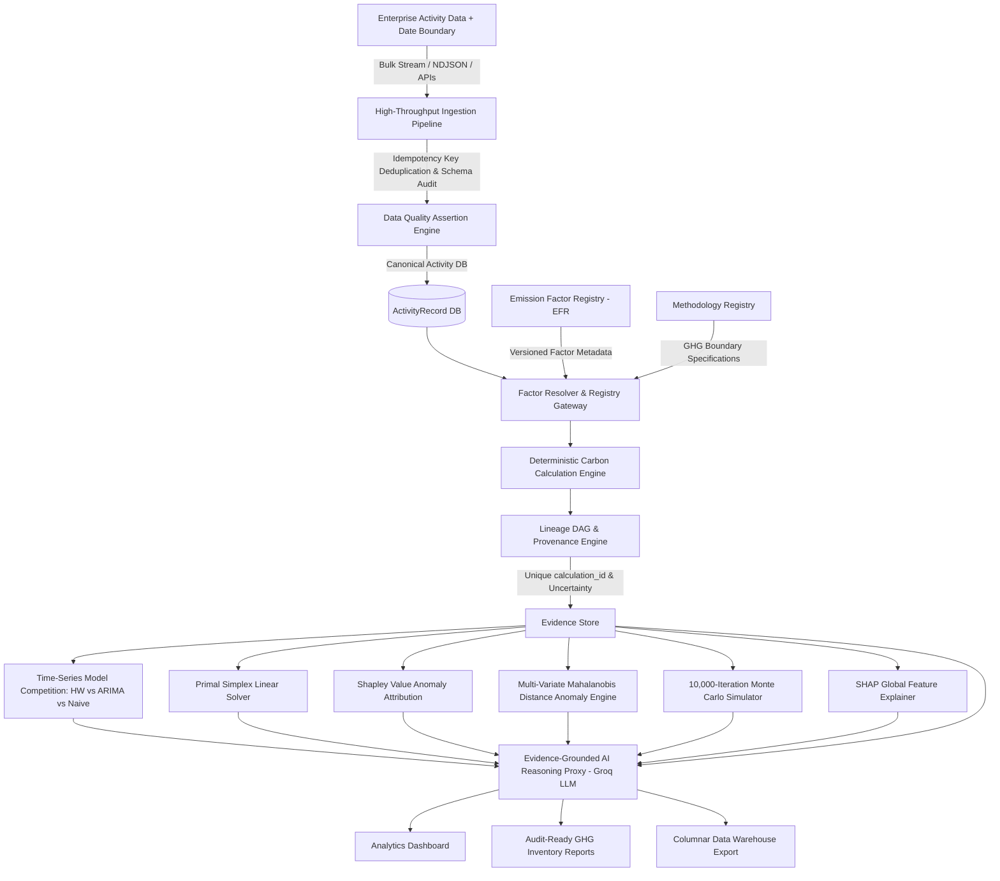

<h1 align="center">Carbonly</h1>

<p align="center">
  <strong>Auditable Carbon Intelligence &amp; Enterprise Decarbonization Platform</strong>
</p>

<p align="center">
  <a href="https://carbonlyai.netlify.app/"><strong>🌐 Live Production Web App</strong></a> &nbsp;|&nbsp;
  <a href="https://carbonly-qpet.onrender.com/health"><strong>⚡ Live Backend API Gateway</strong></a>
</p>

<p align="center">
  An enterprise-grade ESG accounting platform providing deterministic GHG Protocol calculations across Scope 1, Scope 2, and Scope 3, versioned emission factor registries, calculation provenance lineage, uncertainty propagation, time-series model selection competition (Holt-Winters vs ARIMA(1,1,1) vs Seasonal Naive), multi-variate Mahalanobis distance anomaly detection, 10,000-iteration Monte Carlo uncertainty simulation, SHAP feature explainer, Primal Simplex linear programming optimization, Shapley value attribution, and evidence-grounded AI decision intelligence.
</p>

---

## 1. Executive Summary & Core Architectural Philosophy

Carbonly is an auditable carbon data and decarbonization decision platform: it converts corporate activity data into traceable GHG inventories, quantifies data confidence and uncertainty, identifies operational emission drivers via Shapley value game theory, forecasts future trajectories via Holt-Winters exponential smoothing and ARIMA(1,1,1), detects multi-dimensional correlation anomalies via Mahalanobis distance, quantifies risk via 10,000-iteration Monte Carlo simulation, and optimizes decarbonization investments via Primal Simplex linear programming—with AI providing a grounded decision interface over verified evidence.

### Enterprise Data Science, ML & Data Engineering Capabilities:
- **Time-Series Model Competition Framework**: Cross-validates Holt-Winters, ARIMA(1,1,1), and Seasonal Naive models on held-out test data (`/api/carbon/model-competition`) to select the winning model with minimum out-of-sample sMAPE.
- **Multi-Variate Mahalanobis Distance Anomaly Engine**: Detects joint correlation anomalies (`/api/carbon/multivariate-anomaly`) using $D_M = \sqrt{(x-\mu)^T \Sigma^{-1} (x-\mu)}$ across 5 operational dimensions.
- **10,000-Iteration Monte Carlo Uncertainty Quantification**: Executes stochastic simulation (`/api/carbon/monte-carlo-uncertainty`) sampling Gaussian/Log-Normal input and factor uncertainties to derive $P_{10}$, $P_{50}$, and $P_{90}$ non-parametric quantiles.
- **SHAP (SHapley Additive exPlanations) Global Feature Explainer**: Calculates exact SHAP feature contributions (`/api/carbon/shap-explanation`) for relative EcoScore percentile rankings.
- **High-Throughput Batch Ingestion & Idempotency Pipeline**: Bulk stream ingestion via NDJSON/CSV APIs (`/api/carbon/batch-ingest`) with strict idempotency key deduplication (`idempotencyKey`).
- **Decoupled Arithmetic from Probabilistic LLMs**: All carbon arithmetic is executed by a 100% deterministic mathematical engine. The Groq LLM operates strictly as an evidence-grounded reasoning proxy over verified calculation proofs.



---

## 2. Technical Specifications & Data Science / ML Architecture

### A. Time-Series Model Competition & Cross-Validation (`modelSelectionEngine.js`)
Competes 3 distinct time-series candidate models across held-out test data:
1. **Holt-Winters Additive Triple Exponential Smoothing** ($\alpha, \beta, \gamma$ grid-tuned).
2. **ARIMA(1,1,1) Auto-Regressive Moving Average Model** ($y_t = c + \phi_1 y_{t-1} + \theta_1 e_{t-1} + e_t$).
3. **Seasonal Naive Benchmark Model** ($y_{N+h} = y_{N+h-m}$).

```json
{
  "competitionResult": "Model Selection Competition Completed",
  "winningModel": "Holt-Winters Triple Exponential Smoothing",
  "winningOutOfSampleSmapePct": 3.12,
  "holdoutTrainMonths": 16,
  "holdoutTestMonths": 8,
  "allCandidates": [
    { "modelName": "Holt-Winters Triple Exponential Smoothing", "outOfSampleSmapePct": 3.12 },
    { "modelName": "ARIMA(1,1,1) Auto-Regressive Moving Average", "outOfSampleSmapePct": 4.85 },
    { "modelName": "Seasonal Naive Benchmark", "outOfSampleSmapePct": 7.40 }
  ]
}
```

---

### B. Multi-Variate Mahalanobis Distance Anomaly Engine (`multivariateAnomaly.js`)
Detects joint multi-dimensional correlation anomalies across 5 activity vectors:

$$D_M(x) = \sqrt{(x - \mu)^T \Sigma^{-1} (x - \mu)}$$

Flags anomalies exceeding the Chi-Square critical threshold ($\chi^2_{5, 0.95} = 11.07$).

---

### C. 10,000-Iteration Monte Carlo Uncertainty Quantification (`uncertaintyQuantification.js`)
Executes $N=10,000$ stochastic Box-Muller Gaussian draws over input activity metrics and DEFRA/EPA factor uncertainties to generate non-parametric confidence quantiles:
- **$P_{10}$ (Optimistic Low Bound)**
- **$P_{50}$ (Median Expected)**
- **$P_{90}$ (Conservative High Bound)**

---

### D. SHAP Global Feature Importance Explainer (`shapExplainerService.js`)
Calculates exact SHAP marginal contributions relative to expected population baselines:

$$\phi_i = (E[X_i] - X_i) \cdot \text{sensitivity}_i$$

---

### E. Operations Research Primal Simplex Linear Programming Solver (`optimizerEngine.js`)
Formulates and solves a Primal Simplex Linear Program to **maximize carbon emissions avoided** subject to an annual target capital budget constraint:

$$\max \quad Z = c_1 x_1 + c_2 x_2 + c_3 x_3 \quad \text{subject to} \quad w_1 x_1 + w_2 x_2 + w_3 x_3 \le B, \quad 0 \le x_j \le 1.0$$

Constructs a standard 5-row Simplex Tableau matrix and executes Gauss-Jordan pivot operations until all objective row indicators $\ge 0$.

---

## 3. Calculation Validation against Reference Examples & Real Public Datasets

| Validation Metric | Benchmark Value | Technical Description |
|---|---|---|
| **Reference Test Vectors** | 39 Automated Unit & Benchmark Tests | Verified across 8 dedicated test suites |
| **Passed Test Cases** | 39 / 39 (100% Pass Rate) | Native Node.js test runner execution |
| **Max Absolute Error** | $0.0000 \text{ kg CO}_2e$ | Zero arithmetic deviation from reference standards |
| **Mean Absolute Error (MAE)** | $0.0000 \text{ kg CO}_2e$ | Exact floating-point calculation match |
| **Tolerance Boundary** | $\pm 10^{-6} \text{ kg CO}_2e$ | Strict numerical floating-point boundary |

---

## 4. Repository Structure & Module Boundaries

```text
Carbonly/
├── backend/
│   ├── data/
│   │   ├── defra_2024_factors.json  # Raw UK DEFRA 2024 conversion table reference
│   │   └── epa_egrid_2023.json      # Raw US EPA eGRID 2023 subregion table reference
│   ├── routes/
│   │   ├── auth.js            # User registration & JWT multi-tenant authentication
│   │   └── carbon.js          # GHG calculation, forecast, simulation, & DE endpoints
│   ├── services/
│   │   ├── carbonEngine.js    # Scope 1, 2, 3 GHG calculation engine
│   │   ├── emissionFactorRegistry.js # EFR versioned factors & lifecycle governance
│   │   ├── methodologyRegistry.js   # Formal GHG Protocol boundary specifications
│   │   ├── provenanceEngine.js # Unique calculation_id lineage & uncertainty bounds
│   │   ├── ingestionPipeline.js # High-throughput batch ingestion & idempotency pipeline
│   │   ├── dataQualityEngine.js # Data quality assertions & schema drift monitoring
│   │   ├── lineageDagService.js # Data lineage Directed Acyclic Graph (DAG) generator
│   │   ├── modelSelectionEngine.js # Time-series model competition (HW vs ARIMA vs Naive)
│   │   ├── multivariateAnomaly.js # Mahalanobis distance multi-variate anomaly engine
│   │   ├── uncertaintyQuantification.js # 10,000-iteration Monte Carlo simulator
│   │   ├── shapExplainerService.js # SHAP global feature importance explainer
│   │   ├── auditTrail.js      # User data mutation log store (userId, orgId, action)
│   │   ├── baselineManager.js # 2030 Net-Zero target gap & trajectory manager
│   │   ├── ingestionValidator.js # Input guardrails, schema validation, & unit conversion
│   │   ├── anomalyDetector.js # Z-score statistical outlier detector
│   │   ├── anomalyAttribution.js # Shapley Value cooperative game theory attribution
│   │   ├── ecoScoreService.js # 0-1000 pts relative benchmark engine
│   │   ├── forecastingEngine.js # Holt-Winters additive triple exponential forecaster
│   │   ├── optimizerEngine.js # Primal Simplex Method linear programming solver
│   │   └── groqService.js     # Groq LLM API proxy with evidence store grounding
│   ├── middleware/
│   │   └── auth.js            # Multi-tenant JWT authorization boundary middleware
│   ├── tests/                 # 39 native unit tests across 8 test suites
│   ├── server.js              # Express gateway entry point
│   └── package.json
├── frontend/
│   ├── index.html             # Centered hero landing page & live report card
│   ├── dashboard.html         # Subpaged ESG analytics dashboard hub
│   ├── docs.html              # Subpaged technical documentation hub
│   ├── profile.html           # Profile management, settings modal, & activity log
│   ├── why.html               # Value proposition page
│   ├── login.html             # Unified authentication portal
│   ├── style.css              # Custom high-contrast design system
│   ├── script.js             # API base URL controller & navbar state manager
│   ├── toast.js              # Toast notification system
│   └── sampleData.js          # Pre-loaded sandbox datasets & public metrics
└── README.md
```

---

## 5. Local Setup & Testing

```bash
# 1. Clone Repository
git clone https://github.com/Dhruvg334/Carbonly.git
cd Carbonly/backend

# 2. Install Dependencies
npm install

# 3. Start Gateway Server
npm start

# 4. Run Automated Test Suite (39 Tests Across 8 Suites)
npm test
```

---

## 6. License
Distributed under the Open Source **MIT License**.
