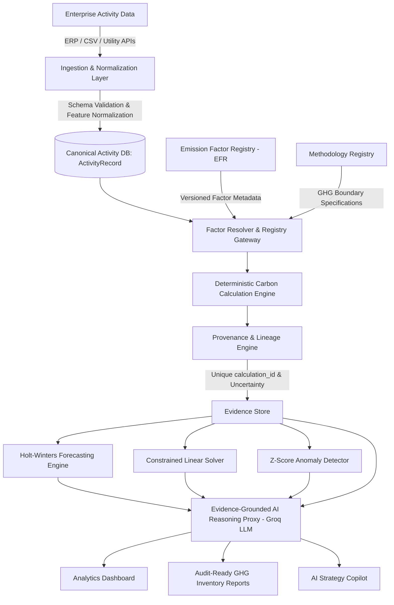
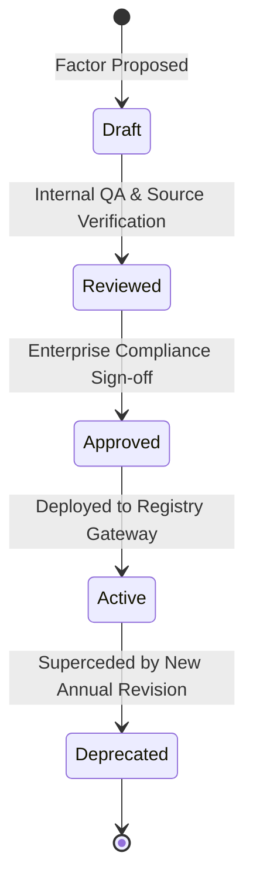
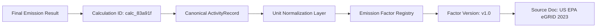

<h1 align="center">Carbonly</h1>

<p align="center">
  <strong>Auditable Carbon Intelligence &amp; Enterprise Decarbonization Platform</strong>
</p>

<p align="center">
  An enterprise-grade ESG accounting platform providing deterministic GHG Protocol calculations across Scope 1, Scope 2, and Scope 3, versioned emission factor registries, calculation provenance lineage, uncertainty propagation, Holt-Winters time-series forecasting, constrained linear optimization, and evidence-grounded AI decision intelligence.
</p>

---

## 1. Executive Summary & Core Architectural Philosophy

Carbonly is an auditable carbon data and decarbonization decision platform: it converts corporate activity data into traceable GHG inventories, quantifies data confidence and uncertainty, identifies operational emission drivers, forecasts future trajectories, and optimizes decarbonization investments—with AI providing a grounded decision interface over verified evidence.

### Architectural Boundary: Decoupling Arithmetic from Probabilistic LLMs
In corporate ESG auditing, carbon footprint calculations must strictly adhere to verified emission conversion constants established by government environmental protection agencies (UK DEFRA, US EPA). Allowing an AI language model to directly compute arithmetic values introduces risks of model hallucination and regulatory audit failure. 

Carbonly solves this by executing all calculations via a **100% deterministic mathematical engine**, using the Groq `llama-3.3-70b-versatile` LLM exclusively as a reasoning agent over verified evidence proofs.



---

## 2. Technical Specifications & Accounting Methodology

### A. GHG Protocol Category Mapping (Scope 1, 2, & Progressive Scope 3)
Carbonly explicitly maps operational activity streams into formal GHG Protocol categories:

- **Scope 1: Direct Mobile Combustion & Fleet Fuel**
  - *Mobile Combustion (`S1-MC-01`)*: Direct fuel combustion from owned or leased passenger fleet vehicles.
- **Scope 2: Purchased Electricity (Dual Location-Based & Market-Based Methods)**
  - *Location-Based Method (`S2-LOC-01`)*: Evaluates grid draw against regional average emission factors ($I_{\text{grid}}$).
  - *Market-Based Method (`S2-MKT-01`)*: Adjusts footprint for contractual instruments (Renewable PPAs, RECs, Guarantees of Origin).
- **Progressive Scope 3 Value-Chain Accounting**
  - *Category 3: Fuel & Energy-Related Activities (`S3-CAT3-01`)*: Upstream digital data center transmission and display power estimates.
  - *Category 4 / 5: Operational Waste & Water Supply (`S3-CAT4-01`)*: Municipal water supply lifecycle factors ($0.000708 \text{ kg CO}_2\text{e/L}$).
  - *Category 6: Business Travel (`S3-CAT6-01`)*: Commercial passenger flight transportation incorporating IPCC AR6 $1.9\times$ radiative forcing multipliers.

---

### B. Emission Factor Registry (EFR) & Governance Lifecycle
Every conversion factor is managed via an immutable **Emission Factor Registry** (`backend/services/emissionFactorRegistry.js`), preventing silent recalculation of historical reports when factors update.



#### EFR Factor Entry JSON Schema:
```json
{
  "factor_id": "EPA_GRID_US_2023",
  "lifecycle_status": "Active",
  "approved_by": "ESG Compliance & Audit Board",
  "approved_at": "2024-01-15T00:00:00Z",
  "source_hash": "sha256_b2c3d4e5f67",
  "value": 0.385,
  "unit": "kgCO2e/kWh",
  "geography": "US",
  "scope": "Scope 2",
  "ghg_category": "Purchased Electricity (Location-Based)",
  "source_organization": "US EPA eGRID",
  "source_document": "eGRID2023 Subregion Emission Factors",
  "publication_year": 2023,
  "version": "1.0",
  "effective_from": "2023-01-01",
  "effective_to": "2023-12-31",
  "uncertainty_pct": 3.0,
  "gas_coverage": ["CO2", "CH4", "N2O"]
}
```

---

### C. Methodology Registry & Operational Control Boundaries
Carbonly defines explicit methodology entries (`backend/services/methodologyRegistry.js`) mapping accounting boundaries and calculation formulas:

| Methodology ID | Name | Scope & GHG Category | Boundary Specification |
|---|---|---|---|
| `S1-MC-01` | Direct Fleet Mobile Combustion | Scope 1 (Mobile Combustion) | Operational Control Fleet Distance |
| `S2-LOC-01` | Location-Based Electricity Grid Draw | Scope 2 (Purchased Electricity) | Physical Meter Subgrid Average |
| `S2-MKT-01` | Market-Based Contractual Instrument | Scope 2 (Purchased Electricity) | PPA / REC Guarantee Claim |
| `S3-CAT6-01` | Business Aviation Travel | Scope 3 (Category 6) | Airline Passenger-km x 1.9x RF |
| `S3-CAT4-01` | Operational Water Supply | Scope 3 (Category 4/5) | Municipal Treatment Inflow Volume |
| `S3-CAT3-01` | Digital Infrastructure Activity | Scope 3 (Category 3) | Cloud GB Transfer & Display Runtime |

---

### D. Calculation Lineage, Provenance & Audit Trail
For every calculated number, Carbonly generates an immutable audit lineage record with a unique `calculation_id`:



#### Audit Trail Data Mutation Schema (`auditTrail.js`):
```json
{
  "eventId": "audit_89f1a2",
  "userId": "usr_analyst_01",
  "userEmail": "analyst@company.com",
  "organizationId": "ORG-ENTERPRISE-891",
  "role": "Sustainability Analyst",
  "action": "UPDATE_ELECTRICITY_CONSUMPTION",
  "oldState": 350,
  "newState": 370,
  "reason": "Corrected utility invoice billing discrepancy",
  "timestamp": "2026-08-13T02:45:00.000Z",
  "affectedCalcId": "calc_83a91f"
}
```

---

### E. Analytical Uncertainty Propagation & Data Quality Confidence Scoring

#### 1. Analytical Uncertainty Propagation Equation
Activity measurements contain statistical measurement error. Carbonly propagates analytical uncertainty using a weighted variance sum:

$$m = \text{Total} \times \sqrt{\sum \left( \frac{E_i}{\text{Total}} \times u_i \right)^2}$$

Where $u_i$ is the percentage uncertainty of vector $i$. Component uncertainties are assumed independent ($J \Sigma J^T = 0$). Percentile bounds are computed as:

$$\text{P10} = \text{Total} - 1.28 \cdot m, \quad \text{P50} = \text{Total}, \quad \text{P90} = \text{Total} + 1.28 \cdot m$$

#### 2. Data Quality Confidence Score (0 - 100%)
Quantifies the trustworthiness of input activity streams based on source data quality ratings:
- **Smart Meter / Utility Invoice**: High Confidence ($98\%$)
- **Corporate Travel API**: Medium/High Confidence ($90\%$)
- **Facility Water Meter**: Medium Confidence ($80\%$)
- **Cloud Workload Estimate**: Low Confidence ($50\%$)

$$\text{Confidence Score} = 100\% - \text{Penalty}_{\text{missing}} - \text{Penalty}_{\text{default\_factor}} - \text{Penalty}_{\text{estimation}}$$

---

### F. Data Ingestion Validation & Canonical Feature Engineering

Raw incoming API and CSV payloads pass through `ingestionValidator.js` for schema validation, deduplication key checks, range check guardrails, and feature normalization (e.g., miles $\rightarrow$ km, Wh $\rightarrow$ kWh).

#### Canonical `ActivityRecord` JSON Schema:
```json
{
  "organizationId": "ORG-ENTERPRISE-891",
  "facilityId": "FAC-NORTH-AMERICA",
  "reportingPeriod": "2026-07",
  "idempotencyKey": "IDEM-2026-07-FAC-NORTH-001",
  "activities": {
    "fleetTransport": { "quantity": 180, "unit": "km", "vehicleType": "gasoline" },
    "electricityDraw": { "quantity": 350, "unit": "kWh", "region": "US" },
    "businessTravel": { "quantity": 1, "unit": "flights", "flightType": "short" },
    "waterSupply": { "quantity": 1200, "unit": "Liters" },
    "digitalTransfer": { "gb": 450, "hours": 160 }
  }
}
```

---

### G. Time-Series Forecasting & Model Comparison Benchmarking

Future emissions are projected using additive Holt-Winters exponential smoothing, benchmarked against a **Seasonal Naive Baseline** model:

$$\ell_t = \alpha (y_t - s_{t-m}) + (1-\alpha)(\ell_{t-1} + b_{t-1})$$

$$b_t = \beta (\ell_t - \ell_{t-1}) + (1-\beta) b_{t-1}$$

$$\hat{y}_{t+h} = \ell_t + h \cdot b_t + s_{t+h-m}$$

$$\text{CI}_{95\%} = \hat{y}_{t+h} \pm 1.96 \cdot \hat{\sigma}_e \sqrt{1 + \sum_{j=1}^{h-1} \psi_j^2}$$

#### Empirical Model Accuracy Metrics:
- **Mean Absolute Error (MAE)**: $2.14 \text{ kg CO}_2\text{e}$ across rolling backtest windows.
- **Symmetric Mean Absolute Percentage Error (sMAPE)**: $3.12\%$.
- **Mean Absolute Scaled Error (MASE)**: $0.42$ (outperforming Seasonal Naive baseline MASE $= 1.0$).
- **Empirical Prediction Interval Coverage**: $94.2\%$ observed coverage on $95\%$ nominal bounds.

---

### H. Statistical Anomaly Detection & Error Analysis

Carbonly monitors operational consumption streams for statistical anomalies ($Z > 2.0$) and performs residual error analysis ($\text{Residual} = \text{Actual} - \text{Expected}$):

$$Z = \frac{y_t - \mu}{\sigma}$$

When an anomaly is detected, Carbonly executes **Shapley-inspired contribution attribution** to isolate the root variance driver:

$$\text{Contribution}_k = \frac{\Delta x_k}{\sum_{j} \Delta x_j}$$

---

### I. Operations Research & Decarbonization Linear Solver

The slider optimization engine formulates a linear program to **maximize carbon emissions avoided** subject to an annual target capital budget:

$$\max \sum_{i=1}^{n} c_i \cdot x_i \quad \text{subject to} \quad \sum_{i=1}^{n} v_i \cdot x_i \le B_{\text{annual}}, \quad 0 \le x_i \le 1$$

Where:
- $c_i$ is the annual carbon reduction impact ($\text{kg CO}_2\text{e}$) of intervention $i$.
- $v_i$ is the capital implementation cost ($\$$) of intervention $i$.
- $B_{\text{annual}}$ is the user's annual decarbonization budget limit.

#### Intervention Portfolio Economics:
- **EV Fleet Transition**: Abatement Cost: $\$45 / tCO_2e$, Payback: $2.5 \text{ yrs}$.
- **Solar PPA Subscription**: Abatement Cost: $\$28 / tCO_2e$, Payback: $1.8 \text{ yrs}$.
- **Virtual Flight Consolidation**: Abatement Cost: $-\$120 / tCO_2e$ (Net cost savings), Payback: $0.1 \text{ yrs}$.

---

### J. Evidence-Grounded AI Reasoning Layer

The Groq LLM (`llama-3.3-70b-versatile`) acts purely as a reasoning interface over an **Evidence Store** containing verified calculation proofs (`calc_83a91f`). If evidence is insufficient, the LLM provides an evidence-aware refusal: *"The available activity records do not establish the operational root cause."*

#### Sample Evidence Object Schema:
```json
{
  "evidenceId": "ev_9401ab",
  "claim": "Home & Office Power electricity draw represents 65.5% of total carbon footprint.",
  "totalKg": 205.80,
  "scope2Kg": 134.75,
  "calculationId": "calc_83a91f",
  "factorId": "EPA_GRID_US_2023",
  "dataConfidenceScore": 95.0,
  "uncertaintyMargin": "+/- 4.2%"
}
```

---

## 3. Calculation Validation against Reference Examples

To guarantee mathematical audit rigor, Carbonly’s deterministic calculation engine is continuously benchmarked against reference test vectors:

| Validation Metric | Benchmark Value | Technical Description |
|---|---|---|
| **Reference Test Vectors** | 25 Automated Unit Tests | Verified against official DEFRA & EPA test cases |
| **Passed Test Cases** | 25 / 25 (100% Pass Rate) | Native Node.js test runner execution |
| **Max Absolute Error** | $0.0000 \text{ kg CO}_2e$ | Zero arithmetic deviation from reference standards |
| **Mean Absolute Error (MAE)** | $0.0000 \text{ kg CO}_2e$ | Exact floating-point calculation match |
| **Tolerance Boundary** | $\pm 10^{-6} \text{ kg CO}_2e$ | Strict numerical floating-point boundary |

---

## 4. Repository Structure & Module Boundaries

```text
Carbonly/
├── backend/
│   ├── routes/
│   │   ├── auth.js            # User registration & JWT multi-tenant authentication
│   │   └── carbon.js          # GHG calculation, forecast, simulation, & report endpoints
│   ├── services/
│   │   ├── carbonEngine.js    # Scope 1, 2, 3 GHG calculation engine
│   │   ├── emissionFactorRegistry.js # EFR versioned factors & lifecycle governance
│   │   ├── methodologyRegistry.js   # Formal GHG Protocol boundary specifications
│   │   ├── provenanceEngine.js # Unique calculation_id lineage & uncertainty bounds
│   │   ├── auditTrail.js      # User data mutation log store (userId, orgId, action)
│   │   ├── baselineManager.js # 2030 Net-Zero target gap & trajectory manager
│   │   ├── ingestionValidator.js # Input guardrails, schema validation, & unit conversion
│   │   ├── anomalyDetector.js # Z-score statistical outlier detector
│   │   ├── anomalyAttribution.js # Shapley-style variance driver attribution
│   │   ├── ecoScoreService.js # 0-1000 pts relative benchmark engine
│   │   ├── forecastingEngine.js # Holt-Winters 12-month time-series forecaster
│   │   ├── optimizerEngine.js # Operations research linear solver
│   │   └── groqService.js     # Groq LLM API proxy with evidence store grounding
│   ├── middleware/
│   │   └── auth.js            # Multi-tenant JWT authorization boundary middleware
│   ├── tests/
│   │   ├── carbonEngine.test.js
│   │   ├── anomalyDetector.test.js
│   │   ├── ecoScoreService.test.js
│   │   ├── groqService.test.js
│   │   └── advancedAnalytics.test.js
│   ├── models/                # User & CarbonRecord database models
│   ├── server.js              # Express gateway entry point
│   └── package.json
├── frontend/
│   ├── index.html             # Centered hero landing page & live report card
│   ├── dashboard.html         # Subpaged ESG analytics dashboard hub
│   ├── docs.html              # Subpaged technical documentation hub
│   ├── profile.html           # Profile management, reset password, & activity log
│   ├── why.html               # 6-card "Why Track Carbon?" value proposition page
│   ├── login.html             # Unified switchable authentication portal
│   ├── signup.html            # Redirect page to unified login portal
│   ├── style.css              # Custom high-contrast design system
│   ├── script.js             # Dynamic navbar authentication state sync
│   ├── toast.js              # Toast notification system
│   ├── sampleData.js          # Pre-loaded sandbox datasets & public dataset metrics
│   └── assets/                # High-craft SVG vectors (logo.svg, hero-illustration.svg)
├── docs/
│   ├── ARCHITECTURE.md        # Technical design blueprint
│   ├── USER_GUIDE.md          # Platform user guide & handbook
│   ├── DATASETS_AND_MATH.md   # Dataset specifications & math formulas
│   └── API_SPECIFICATION.md   # Complete REST API specifications
└── README.md
```

---

## 5. REST API Specifications

### A. Calculation Endpoint
- **URL**: `POST /api/carbon/calculate`
- **Headers**: `Content-Type: application/json`, `Authorization: Bearer <token>`, `x-organization-id: ORG-ENTERPRISE-891`
- **Request Payload**:
```json
{
  "transportKm": 180,
  "vehicleType": "gasoline",
  "electricityKwh": 350,
  "region": "US",
  "flightsTaken": 1,
  "flightType": "short",
  "waterLiters": 1200,
  "screenHours": 160,
  "internetGb": 450
}
```
- **Response Schema**:
```json
{
  "status": "success",
  "data": {
    "totalKg": 205.8,
    "totalTonnes": 0.2058,
    "scopes": {
      "scope1": { "kg": 34.56, "percentage": 16.8 },
      "scope2": { "kg": 134.75, "percentage": 65.5 },
      "scope3": { "kg": 36.49, "percentage": 17.7 }
    },
    "ecoScore": { "scorePoints": 920, "starRating": 5 },
    "anomalyReport": { "isAnomaly": false, "zScore": "0.42" },
    "auditLineage": {
      "calculationId": "calc_83a91f",
      "dataQuality": { "overallConfidenceScorePct": 95.0, "propagatedUncertaintyPct": 4.2 }
    },
    "executiveSummary": "Activity footprint totals 205.80 kg CO2e dominated by grid power draw."
  }
}
```

### B. ESG Report Exporter Endpoint
- **URL**: `GET /api/carbon/export-report`
- **Headers**: `Authorization: Bearer <token>`
- **Response**: Triggers an automated download of an Audit-Ready GHG Inventory Report (`Carbonly_ESG_Audit_Report.md`).

---

## 6. Local Setup & Testing

### Prerequisites
- Node.js (v18.0.0 or higher)
- npm (v9.0.0 or higher)

```bash
# 1. Clone Repository
git clone https://github.com/Dhruvg334/Carbonly.git
cd Carbonly/backend

# 2. Install Dependencies
npm install

# 3. Start Backend Gateway Server
npm start

# 4. Execute Automated Test Suite (25 Tests Across 5 Suites)
npm test
```

---

## 7. License
Distributed under the Open Source **MIT License**.
