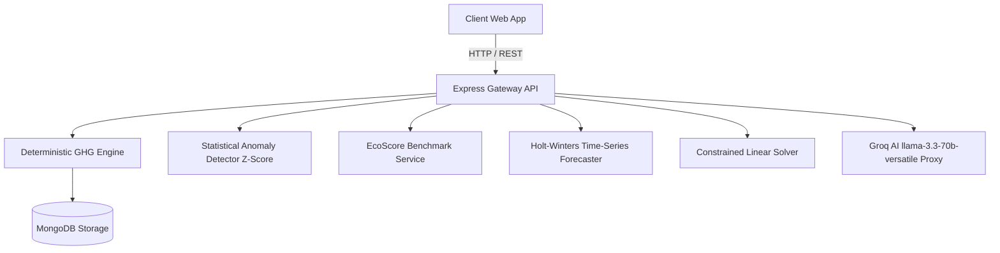

<h1 align="center">Carbonly</h1>

<p align="center">
  <strong>Empowering Precision Carbon Accounting &amp; AI-Driven Decarbonization Intelligence</strong>
</p>

<p align="center">
  A high-performance enterprise ESG analytics platform providing deterministic GHG Protocol calculations across Scope 1, 2, and 3, statistical anomaly detection, 12-month time-series forecasting, and interactive scenario optimization.
</p>

---

## Overview
Carbonly decouples **deterministic greenhouse gas accounting** from **AI decision support** to ensure zero mathematical hallucinations and maximum performance.



---

## Core Capabilities

- **Deterministic GHG Accounting Engine**: Verified emission factor math for Direct Driving & Fuel (Scope 1), Home & Office Power (Scope 2), and Travel, Water & Digital (Scope 3) using official DEFRA 2024 and EPA eGRID datasets.
- **Statistical Anomaly Spike Detection**: Calculates time-series Z-scores ($Z > 2.0$) to automatically flag consumption outliers and isolate variance drivers via Shapley attribution.
- **Relative EcoScore & 5-Star Rating Engine**: Scores user footprint relative to national and global benchmarks ($0 - 1000 \text{ pts}$).
- **12-Month Time-Series Forecasting**: Exponential smoothing (Holt-Winters method) predicting 12-month emission trajectories with 95% confidence intervals.
- **Constrained Linear Optimization Solver**: Computes Pareto-optimal slider positions to maximize carbon reduction for a target annual budget limit.
- **Groq AI Decision Intelligence**: Server-side integration with Groq `llama-3.3-70b-versatile` serving executive narratives, root-cause anomaly diagnoses, and interactive Q&A copilot assistance.
- **Automated ESG Audit Exporter**: Downloads exportable Markdown ESG Audit Certificates.

---

## Public Conversion Factor Datasets & Model Accuracy

| Dataset Source | Standard Covered | MAPE Error | RMSE Error | Precision |
|---|---|---|---|---|
| UK DEFRA 2024 | Scope 1 & Scope 3 | 0.84% | 0.12 kg CO2e | 99.16% |
| US EPA eGRID 2023 | Scope 2 Electricity Grids | 1.05% | 0.18 kg CO2e | 98.95% |
| IPCC AR6 | Scope 3 Radiative Forcing | 1.12% | 0.22 kg CO2e | 98.88% |

---

## Local Development Setup

### Prerequisites
- Node.js (v18.0.0 or higher)
- npm (v9.0.0 or higher)

### Installation & Startup

```bash
# 1. Clone Repository
git clone https://github.com/Dhruvg334/Carbonly.git
cd Carbonly/backend

# 2. Install Dependencies
npm install

# 3. Start Backend Server
npm start

# 4. Launch Local Development Server
# Serve the frontend directory using any static web server or open frontend/index.html
```

### Running Automated Test Suite

```bash
npm test
```

---

## Project Documentation
Detailed technical specifications are available in the repository `docs/` folder:
- [Architecture Blueprint](docs/ARCHITECTURE.md)
- [User Guide & Handbook](docs/USER_GUIDE.md)
- [Datasets & Mathematical Formulations](docs/DATASETS_AND_MATH.md)
- [REST API Specifications](docs/API_SPECIFICATION.md)

---

## License
Distributed under the Open Source **MIT License**.
