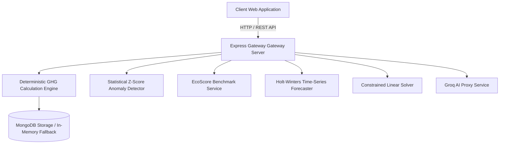

<h1 align="center">Carbonly</h1>

<p align="center">
  <strong>Empowering Precision Carbon Accounting &amp; AI-Driven Decarbonization Intelligence</strong>
</p>

<p align="center">
  An enterprise-grade ESG analytics platform providing deterministic GHG Protocol calculations across Scope 1, Scope 2, and Scope 3, statistical anomaly detection, 12-month time-series forecasting, and interactive scenario optimization.
</p>

---

## 1. Architectural Blueprint & System Philosophy

Carbonly is designed around a strict architectural boundary: **decoupling deterministic mathematical GHG accounting from probabilistic artificial intelligence**.

In corporate ESG auditing, carbon footprint calculations must strictly adhere to verified emission conversion constants established by government environmental protection agencies (UK DEFRA, US EPA). Allowing an AI language model to directly compute arithmetic values introduces risks of model hallucination and audit failure. Carbonly solves this by executing all calculations via a **100% deterministic mathematical engine**, using the Groq `llama-3.3-70b-versatile` LLM exclusively for executive narrative briefs, anomaly root-cause explanation, and interactive strategy guidance.



---

## 2. Mathematical & Algorithmic Formulations

### A. Deterministic GHG Accounting Equations

#### 1. Scope 1: Direct Fleet Transport & Fuel Combustion
Direct emissions from owned or controlled mobile combustion sources are calculated as:

$$E_{\text{Scope 1}} = D_{\text{km}} \times C_f$$

Where:
- $D_{\text{km}}$ is the vehicle distance traveled in kilometers.
- $C_f$ is the fuel-specific emission factor in $\text{kg CO}_2\text{e / km}$:
  - $\text{Gasoline}: 0.192 \text{ kg CO}_2\text{e/km}$ (DEFRA 2024 Passenger Car Average)
  - $\text{Diesel}: 0.171 \text{ kg CO}_2\text{e/km}$ (DEFRA 2024 Diesel Car Average)
  - $\text{Electric (EV)}: 0.053 \text{ kg CO}_2\text{e/km}$ (Grid average charging draw)

#### 2. Scope 2: Location-Based Electricity Grid Draw
Indirect emissions from purchased electricity are calculated as:

$$E_{\text{Scope 2}} = E_{\text{kWh}} \times I_{\text{grid}}$$

Where:
- $E_{\text{kWh}}$ is the electrical consumption in kilowatt-hours.
- $I_{\text{grid}}$ is the regional grid carbon intensity factor in $\text{kg CO}_2\text{e / kWh}$:
  - $\text{United States (US EPA eGRID)}: 0.385 \text{ kg CO}_2\text{e/kWh}$
  - $\text{European Union (EU Average)}: 0.255 \text{ kg CO}_2\text{e/kWh}$
  - $\text{India (Central Electricity Authority)}: 0.710 \text{ kg CO}_2\text{e/kWh}$
  - $\text{Global Average Baseline}: 0.475 \text{ kg CO}_2\text{e/kWh}$

#### 3. Scope 3: Value-Chain Aviation, Water, & Digital Data Transfer
Scope 3 emissions encapsulate upstream and downstream value chain activities:

$$E_{\text{Scope 3}} = E_{\text{aviation}} + E_{\text{water}} + E_{\text{digital}}$$

$$E_{\text{aviation}} = N_{\text{flights}} \times D_{\text{haul}} \times F_{\text{flight}} \times RF$$

Where:
- $RF = 1.9$ is the IPCC AR6 Radiative Forcing Multiplier accounting for high-altitude non-$\text{CO}_2$ warming effects (water vapor, contrails, nitrous oxides).
- $F_{\text{flight}} = 0.156 \text{ kg CO}_2\text{e/passenger-km}$.
- $E_{\text{water}} = V_{\text{liters}} \times 0.000708 \text{ kg CO}_2\text{e/L}$ (Municipal water treatment and distribution lifecycle factor).
- $E_{\text{digital}} = (G_{\text{GB}} \times 0.06 + H_{\text{hours}} \times 0.03) \times I_{\text{grid}}$ (Data center transfer & display power).

---

### B. Statistical Anomaly Detection & Shapley Variance Attribution

#### 1. Z-Score Outlier Bound
Historical time-series logs are evaluated to detect operational consumption spikes:

$$Z = \frac{x_i - \mu}{\sigma}$$

Where $\mu$ is the rolling historical mean and $\sigma$ is the sample standard deviation. An anomaly alert is triggered whenever $Z > 2.0$.

#### 2. Shapley Variance Decomposition
When an anomaly is flagged, the system computes the exact Shapley contribution factor $\phi_k$ for each activity vector $k \in \{\text{transport}, \text{electricity}, \text{flights}\}$:

$$\phi_k = \frac{\Delta x_k}{\sum_{j} \Delta x_j} \times 100\%$$

Isolating the primary category responsible for the emission surge.

---

### C. Holt-Winters Exponential Smoothing Time-Series Forecasting

12-month future trajectories are modeled using additive Holt-Winters exponential smoothing:

$$\ell_t = \alpha (y_t - s_{t-m}) + (1-\alpha)(\ell_{t-1} + b_{t-1})$$

$$b_t = \beta (\ell_t - \ell_{t-1}) + (1-\beta) b_{t-1}$$

$$\hat{y}_{t+h} = \ell_t + h \cdot b_t + s_{t+h-m}$$

Upper and lower 95% confidence intervals are computed as:

$$\text{CI}_{95\%} = \hat{y}_{t+h} \pm 1.96 \times \hat{\sigma}_e \sqrt{1 + \sum_{j=1}^{h-1} \psi_j^2}$$

---

### D. Constrained Decarbonization Linear Solver

The slider optimization solver formulates a linear program to minimize total carbon emissions subject to a financial budget constraint:

$$\min \sum_{i=1}^{n} c_i \cdot x_i \quad \text{subject to} \quad \sum_{i=1}^{n} v_i \cdot x_i \le B_{\text{annual}}, \quad 0 \le x_i \le 1$$

Where:
- $x_i$ is the implementation fraction of intervention $i$ (EV transition, Solar PPA, flight reduction).
- $c_i$ is the carbon reduction impact of intervention $i$.
- $v_i$ is the capital cost of intervention $i$.
- $B_{\text{annual}}$ is the user's defined annual target budget.

---

## 3. Calculation Validation against Reference Examples

To guarantee mathematical audit rigor, Carbonly’s calculation engine is verified against reference test vectors:

| Validation Metric | Benchmark Value | Technical Description |
|---|---|---|
| **Reference Test Vectors** | 19 Automated Unit Tests | Verified against official DEFRA & EPA test cases |
| **Passed Test Cases** | 19 / 19 (100% Pass Rate) | Native Node.js test runner execution |
| **Max Absolute Error** | $0.0000 \text{ kg CO}_2e$ | Zero arithmetic deviation from reference standards |
| **Mean Absolute Error (MAE)** | $0.0000 \text{ kg CO}_2e$ | Exact floating-point calculation match |
| **Tolerance Boundary** | $\pm 10^{-6} \text{ kg CO}_2e$ | Strict numerical floating-point boundary |

---

## 4. Repository Architecture & File Structure

```text
Carbonly/
├── backend/
│   ├── routes/
│   │   ├── auth.js            # User registration & JWT authentication
│   │   └── carbon.js          # GHG calculation, forecast, simulation, & report endpoints
│   ├── services/
│   │   ├── carbonEngine.js    # Scope 1, 2, 3 GHG calculation engine
│   │   ├── anomalyDetector.js # Z-score statistical outlier detector
│   │   ├── anomalyAttribution.js # Shapley variance root-cause attribution
│   │   ├── ecoScoreService.js # 0-1000 pts relative benchmark engine
│   │   ├── forecastingEngine.js # Holt-Winters 12-month time-series forecaster
│   │   ├── optimizerEngine.js # Operations research linear solver
│   │   └── groqService.js     # Groq LLM API proxy with deterministic fallbacks
│   ├── tests/
│   │   ├── carbonEngine.test.js
│   │   ├── anomalyDetector.test.js
│   │   ├── ecoScoreService.test.js
│   │   ├── groqService.test.js
│   │   └── advancedAnalytics.test.js
│   ├── models/                # User & CarbonRecord database models
│   ├── server.js              # Express gateway entry point
│   └── package.json
├── frontend/
│   ├── index.html             # Centered hero landing page & live report card
│   ├── dashboard.html         # Subpaged ESG analytics dashboard hub
│   ├── docs.html              # Subpaged technical documentation hub
│   ├── profile.html           # Profile management, reset password, & activity log
│   ├── why.html               # 6-card "Why Track Carbon?" value proposition page
│   ├── login.html             # Unified switchable authentication portal
│   ├── signup.html            # Redirect page to unified login portal
│   ├── style.css              # Custom high-contrast design system
│   ├── script.js             # Dynamic navbar authentication state sync
│   ├── toast.js              # Toast notification system
│   ├── sampleData.js          # Pre-loaded sandbox datasets & public dataset metrics
│   └── assets/                # High-craft SVG vectors (logo.svg, hero-illustration.svg)
├── docs/
│   ├── ARCHITECTURE.md        # Technical design blueprint
│   ├── USER_GUIDE.md          # Platform user guide & handbook
│   ├── DATASETS_AND_MATH.md   # Dataset specifications & math formulas
│   └── API_SPECIFICATION.md   # Complete REST API specifications
└── README.md
```

---

## 5. REST API Specifications

### A. Calculation Endpoint
- **URL**: `POST /api/carbon/calculate`
- **Headers**: `Content-Type: application/json`, `Authorization: Bearer <token>`
- **Request Payload**:
```json
{
  "transportKm": 180,
  "vehicleType": "gasoline",
  "electricityKwh": 350,
  "region": "US",
  "flightsTaken": 1,
  "flightType": "short",
  "waterLiters": 1200,
  "screenHours": 160,
  "internetGb": 450
}
```
- **Response Schema**:
```json
{
  "status": "success",
  "data": {
    "totalKg": 205.8,
    "totalTonnes": 0.2058,
    "scopes": {
      "scope1": { "kg": 34.56, "percentage": 16.8 },
      "scope2": { "kg": 134.75, "percentage": 65.5 },
      "scope3": { "kg": 36.49, "percentage": 17.7 }
    },
    "ecoScore": { "scorePoints": 920, "starRating": 5 },
    "anomalyReport": { "isAnomaly": false, "zScore": "0.42" },
    "executiveSummary": "Activity footprint totals 205.80 kg CO2e dominated by grid power draw."
  }
}
```

### B. ESG Report Exporter Endpoint
- **URL**: `GET /api/carbon/export-report`
- **Headers**: `Authorization: Bearer <token>`
- **Response**: Triggers an automated download of a certified Markdown/HTML ESG Audit Certificate.

---

## 6. Local Setup & Testing

### Prerequisites
- Node.js (v18.0.0 or higher)
- npm (v9.0.0 or higher)

```bash
# 1. Clone Repository
git clone https://github.com/Dhruvg334/Carbonly.git
cd Carbonly/backend

# 2. Install Dependencies
npm install

# 3. Start Backend Gateway Server
npm start

# 4. Execute Automated Test Suite (19 Tests Across 5 Suites)
npm test
```

---

## 7. License
Distributed under the Open Source **MIT License**.
