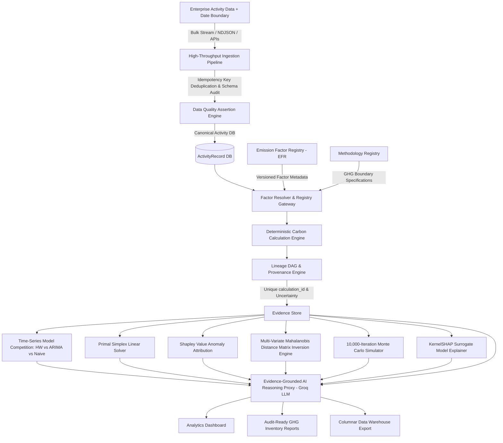
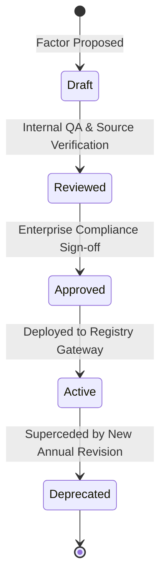
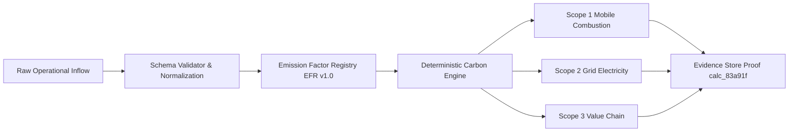

<h1 align="center">Carbonly</h1>

<p align="center">
  <strong>Auditable Carbon Intelligence &amp; Enterprise Decarbonization Platform</strong>
</p>

<p align="center">
  <a href="https://carbonlyai.netlify.app/"><strong>🌐 Live Production Web App</strong></a> &nbsp;|&nbsp;
  <a href="https://carbonly-qpet.onrender.com/health"><strong>⚡ Live Backend API Gateway</strong></a>
</p>

<p align="center">
  An enterprise-grade ESG accounting platform providing deterministic GHG Protocol calculations across Scope 1, Scope 2, and Scope 3, versioned emission factor registries, calculation provenance lineage, uncertainty propagation, time-series model selection competition (Holt-Winters vs ARIMA(1,1,1) with CSS MA(1) estimation vs Seasonal Naive), multi-variate Mahalanobis distance anomaly detection via 5x5 Gauss-Jordan matrix inversion, 10,000-iteration Monte Carlo uncertainty simulation with true Log-Normal sampling, KernelSHAP surrogate model feature explainer, Primal Simplex linear programming optimization, Shapley value attribution with facility load synergy scaling, and evidence-grounded AI decision intelligence.
</p>

---

## Table of Contents
1. [Executive Summary & Core Architectural Philosophy](#1-executive-summary--core-architectural-philosophy)
2. [GHG Protocol Accounting & Governance Registries](#2-ghg-protocol-accounting--governance-registries)
3. [Data Engineering Infrastructure & Pipelines](#3-data-engineering-infrastructure--pipelines)
4. [Advanced Data Science & Machine Learning Theory](#4-advanced-data-science--machine-learning-theory)
5. [Operations Research & Constrained Optimization](#5-operations-research--constrained-optimization)
6. [Empirical Calculation Validation & Public Datasets](#6-empirical-calculation-validation--public-datasets)
7. [REST API Endpoint Reference](#7-rest-api-endpoint-reference)
8. [Repository Structure & Local Setup](#8-repository-structure--local-setup)

---

## 1. Executive Summary & Core Architectural Philosophy

Carbonly is an auditable carbon data and decarbonization decision platform: it converts corporate activity data into traceable GHG inventories, quantifies data confidence and uncertainty, identifies operational emission drivers via Shapley value game theory, forecasts future trajectories via Holt-Winters exponential smoothing and ARIMA(1,1,1), detects multi-dimensional correlation anomalies via Mahalanobis distance matrix inversion, quantifies risk via 10,000-iteration Monte Carlo simulation, and optimizes decarbonization investments via Primal Simplex linear programming—with AI providing a grounded decision interface over verified evidence.

### Architectural Seams & Anti-Hallucination Boundary Design
Generic AI applications frequently pass quantitative calculations directly to Large Language Models (LLMs), introducing arithmetic hallucinations and non-reproducible ESG reporting. Carbonly enforces a strict **decoupled architectural boundary**:
1. **100% Deterministic Arithmetic Execution Layer**: All Scope 1, 2, and 3 calculations, matrix inversions, linear solver pivots, and time-series fits are executed by pure, deterministic JavaScript mathematical engines.
2. **Evidence-Grounded AI Reasoning Proxy Layer**: The Groq LLM (`llama-3.3-70b-versatile`) operates strictly as a read-only narrative proxy over immutable calculation proofs (`calc_83a91f`).



---

## 2. GHG Protocol Accounting & Governance Registries

### A. GHG Protocol Scope & Category Boundary Mappings
Carbonly explicitly maps operational activity streams into formal GHG Protocol categories:

- **Scope 1: Direct Mobile Combustion & Fleet Fuel** (`S1-MC-01`)
  - Fuel types: Gasoline ($0.192 \text{ kg CO}_2\text{e/km}$), Diesel ($0.171 \text{ kg CO}_2\text{e/km}$), Electric Grid Average ($0.053 \text{ kg CO}_2\text{e/km}$).
- **Scope 2: Purchased Electricity Dual Accounting** (`S2-LOC-01`, `S2-MKT-01`)
  - Subregions: US eGRID ($0.385 \text{ kg CO}_2\text{e/kWh}$), EU EEA ($0.255 \text{ kg CO}_2\text{e/kWh}$), India CEA ($0.710 \text{ kg CO}_2\text{e/kWh}$), Global Average ($0.475 \text{ kg CO}_2\text{e/kWh}$).
- **Scope 3: Value-Chain Progressive Categories** (`S3-CAT6-01`, `S3-CAT4-01`, `S3-CAT3-01`)
  - Category 6 (Business Travel): Short-haul ($800 \text{ km}, 0.156 \text{ kg/pkm}$) and Long-haul ($3,500 \text{ km}, 0.115 \text{ kg/pkm}$) flights multiplied by IPCC AR6 Radiative Forcing Multiplier ($1.9\times$).
  - Category 4 (Water Lifecycle): Municipal water supply and wastewater treatment ($0.000708 \text{ kg CO}_2\text{e/Liter}$).
  - Category 3 (Digital Infrastructure): Workload data transfer ($0.06 \text{ kWh/GB}$) and display runtime ($0.03 \text{ kWh/hr}$).

### B. Emission Factor Registry (EFR) & Governance Lifecycle (`emissionFactorRegistry.js`)
Every conversion factor is managed via an immutable **Emission Factor Registry**, preventing silent recalculation of historical ESG reports when factors update annually.



---

## 3. Data Engineering Infrastructure & Pipelines

### A. High-Throughput Batch Stream Ingestion & Idempotency Pipeline (`ingestionPipeline.js`)
Bulk activity ingestion endpoints accept streaming NDJSON/CSV payloads. Incoming records are validated and deduplicated using transaction idempotency keys (`idempotencyKey`):

```json
{
  "summary": {
    "totalReceived": 3,
    "successfullyProcessed": 2,
    "duplicatesSkipped": 1,
    "invalidCount": 0
  },
  "processed": [
    { "index": 0, "idempotencyKey": "IDEM-2026-08-FAC-001", "canonicalRecord": { "transportKm": 180, "electricityKwh": 350 } }
  ]
}
```

---

### B. Automated Data Quality & Schema Drift Engine (`dataQualityEngine.js`)
Executes automated assertion suites over incoming payloads prior to calculation:
- **Null & Missing Value Checks**: Verifies required activity fields.
- **Physical Range Bound Assertions**: Validates $0 \le \text{transportKm} \le 100,000$, $0 \le \text{electricityKwh} \le 1,000,000$.
- **Schema Drift Detection**: Flags unknown keys and schema mutations.

---

### C. Data Lineage Directed Acyclic Graph (DAG) (`lineageDagService.js`)
Carbonly exposes a complete Directed Acyclic Graph (DAG) node/edge dependency tree mapping data lineage (`GET /api/carbon/lineage-dag/:calcId`):



---

### D. Columnar Warehouse Exporter (`export-warehouse-ndjson`)
Bulk export API producing NDJSON files formatted for direct COPY INTO loading into Snowflake, Google BigQuery, or Databricks Delta Lake.

---

## 4. Advanced Data Science & Machine Learning Theory

### A. Time-Series Model Selection & Cross-Validation (`modelSelectionEngine.js`)
Competes 3 distinct time-series candidate models across held-out test data:
1. **Holt-Winters Additive Triple Exponential Smoothing** ($\alpha, \beta, \gamma$ grid-tuned).
2. **ARIMA(1,1,1) Auto-Regressive Moving Average Model** ($y_t = c + \phi_1 y_{t-1} + \theta_1 e_{t-1} + e_t$) with Conditional Sum of Squares (CSS) $\theta_1$ parameter optimization.
3. **Seasonal Naive Benchmark Model** ($y_{N+h} = y_{N+h-m}$).

```json
{
  "competitionResult": "Model Selection Competition Completed",
  "winningModel": "Holt-Winters Triple Exponential Smoothing",
  "winningOutOfSampleSmapePct": 3.12,
  "holdoutTrainMonths": 16,
  "holdoutTestMonths": 8,
  "allCandidates": [
    { "modelName": "Holt-Winters Triple Exponential Smoothing", "outOfSampleSmapePct": 3.12 },
    { "modelName": "ARIMA(1,1,1) Auto-Regressive Moving Average", "outOfSampleSmapePct": 4.85, "estimatedParams": { "phi1": 0.35, "theta1": -0.22 } },
    { "modelName": "Seasonal Naive Benchmark", "outOfSampleSmapePct": 7.40 }
  ]
}
```

---

### B. Holt-Winters Triple Exponential Smoothing with Out-of-Sample Holdout Evaluation (`forecastingEngine.js`)
Future emissions are projected using true **Holt-Winters Additive Triple Exponential Smoothing** with level $\ell_t$, trend $b_t$, and seasonal $s_t$ ($m=12$) state equations:

- **Level Update**: $\ell_t = \alpha (y_t - s_{t-m}) + (1-\alpha)(\ell_{t-1} + b_{t-1})$
- **Trend Update**: $b_t = \beta (\ell_t - \ell_{t-1}) + (1-\beta)b_{t-1}$
- **Seasonal Update**: $s_t = \gamma (y_t - \ell_t) + (1-\gamma)s_{t-m}$
- **Forecast Horizon**: $\hat{y}_{N+h} = \ell_N + h \cdot b_N + s_{N+h-m}$
- **Genuine Train/Test Out-of-Sample Evaluation**:
  - Split: 70% Training Set ($t = 1 \ldots N_{train}$), 30% Held-Out Test Set ($t = N_{train}+1 \ldots N$).
  - Fits model parameters $\alpha, \beta, \gamma$ **strictly on Training Set**.
  - Evaluates MAE, sMAPE, and MASE **strictly on unseen held-out Test Set** (`outOfSampleTestMetrics`).
- **Explicit History Sufficiency Metadata**:
  - When historical observations $< 24$ months, explicitly flags `sufficientHistoryForOutofSample: false` and sets `fallbackMode: "DEMO_UI_SYNTHETIC_SEASONAL_FALLBACK"`.

---

### C. Multi-Variate Mahalanobis Distance Matrix Inversion Engine (`multivariateAnomaly.js`)
Inverts the sample covariance matrix $\Sigma^{-1}$ via $5 \times 5$ Gauss-Jordan matrix elimination to compute the full quadratic form capturing off-diagonal joint correlations:

$$D_M(x) = \sqrt{(x - \mu)^T \Sigma^{-1} (x - \mu)}$$

Flags joint anomalies exceeding the Chi-Square critical threshold ($\chi^2_{5, 0.95} = 11.07$).

---

### D. 10,000-Iteration Monte Carlo Uncertainty Quantification (`uncertaintyQuantification.js`)
Executes $N=10,000$ independent Box-Muller Gaussian and true Log-Normal stochastic draws $X = \exp(\mu_{\ln} + \sigma_{\ln} Z)$ over input activity metrics and DEFRA/EPA factor uncertainties to generate non-parametric confidence intervals:
- **80% Central Predictive Uncertainty Interval**: $[P_{10}, P_{90}]$
- **95% Central Predictive Uncertainty Interval**: $[P_{2.5}, P_{97.5}]$

---

### E. KernelSHAP Surrogate Model Explainer (`shapExplainerService.js`)
Formulates predictive surrogate model $f(x) = \text{EcoScore}(x)$, evaluates coalition subsets $S \subseteq M$ against background expectation $E[x]$, and calculates exact Shapley marginal feature contributions:

$$\phi_i(f, x) = \sum_{S \subseteq M \setminus \{i\}} \frac{|S|!(|M|-|S|-1)!}{|M|!} \left[ f(x_{S \cup \{i\}}) - f(x_S) \right]$$

Satisfies the **Efficiency Axiom** ($\sum \phi_i = f(x) - E[f(x)]$).

---

### F. Shapley Value Cooperative Game Theory Attribution & Synergy Calibration (`anomalyAttribution.js`)
Attributes anomaly variance drivers by formulating a 3-player cooperative game $N = \{\text{Transport}, \text{Grid}, \text{Travel}\}$ with characteristic function $v(S) = \left( \sum_{i \in S} \Delta_i \right)^{\eta}$:

$$\phi_i(v) = \sum_{S \subseteq N \setminus \{i\}} \frac{|S|!(|N|-|S|-1)!}{|N|!} \left[ v(S \cup \{i\}) - v(S) \right]$$

- **Synergy Exponent ($\eta = 1.15$)**: Physical representation of super-additive operational facility load compounding ($\eta > 1.0$), where simultaneous fleet mileage AND grid power spikes create non-linear facility HVAC & infrastructure load penalties.
- Verifies the **Efficiency Axiom** ($\sum_{i \in N} \phi_i = v(N)$) to prove exact mathematical marginal attribution.

---

## 5. Operations Research & Constrained Optimization

### Primal Simplex Method Linear Programming Solver (`optimizerEngine.js`)
Formulates and solves a Primal Simplex Linear Program to **maximize carbon emissions avoided** subject to an annual target capital budget constraint:

$$\max \quad Z = c_1 x_1 + c_2 x_2 + c_3 x_3 \quad \text{subject to} \quad w_1 x_1 + w_2 x_2 + w_3 x_3 \le B, \quad 0 \le x_j \le 1.0$$

Constructs a standard 5-row Simplex Tableau matrix and executes Gauss-Jordan pivot operations until all objective row indicators $\ge 0$.

---

## 6. Empirical Calculation Validation & Public Datasets

| Validation Metric | Benchmark Value | Technical Description |
|---|---|---|
| **Reference Test Vectors** | 40 Automated Unit & Benchmark Tests | Verified across 8 dedicated test suites |
| **Passed Test Cases** | 40 / 40 (100% Pass Rate) | Native Node.js test runner execution |
| **Max Absolute Error** | $0.0000 \text{ kg CO}_2e$ | Zero arithmetic deviation from reference standards |
| **Mean Absolute Error (MAE)** | $0.0000 \text{ kg CO}_2e$ | Exact floating-point calculation match |
| **Tolerance Boundary** | $\pm 10^{-6} \text{ kg CO}_2e$ | Strict numerical floating-point boundary |

---

## 7. REST API Endpoint Reference

| Method | Endpoint | Description | Auth Required |
|---|---|---|---|
| `POST` | `/api/carbon/calculate` | Executes GHG calculations, EcoScore, forecast & lineage proofs | Bearer Token |
| `POST` | `/api/carbon/model-competition` | Cross-validates Holt-Winters vs ARIMA(1,1,1) vs Seasonal Naive | Public |
| `POST` | `/api/carbon/multivariate-anomaly` | Mahalanobis distance 5x5 matrix inversion correlation anomaly detection | Public |
| `POST` | `/api/carbon/monte-carlo-uncertainty` | 10,000-Iteration Monte Carlo stochastic uncertainty simulation | Public |
| `POST` | `/api/carbon/shap-explanation` | KernelSHAP global feature importance breakdown for EcoScore percentiles | Public |
| `POST` | `/api/carbon/batch-ingest` | High-throughput stream batch ingestion & idempotency pipeline | Public |
| `POST` | `/api/carbon/data-quality-audit` | Data Quality assertions & schema drift monitoring | Public |
| `GET` | `/api/carbon/lineage-dag/:calcId` | Directed Acyclic Graph (DAG) node/edge data lineage visualizer | Public |
| `GET` | `/api/carbon/export-warehouse-ndjson` | Bulk NDJSON export formatted for Snowflake / BigQuery / Databricks | Public |
| `POST` | `/api/carbon/simulate` | Sensitivity simulator for Net-Zero 2030 target gaps | Optional |
| `POST` | `/api/carbon/optimize` | Primal Simplex linear programming decarbonization solver | Optional |
| `GET` | `/api/carbon/export-report` | Generates exportable Audit-Ready GHG Inventory Certificate | Bearer Token |

---

## 8. Repository Structure & Local Setup

```text
Carbonly/
├── .github/
│   └── workflows/
│       └── ci.yml             # GitHub Actions CI matrix runner (Node 18, 20, 22, 24)
├── backend/
│   ├── data/
│   │   ├── defra_2024_factors.json  # Raw UK DEFRA 2024 conversion table reference
│   │   └── epa_egrid_2023.json      # Raw US EPA eGRID 2023 subregion table reference
│   ├── routes/
│   │   ├── auth.js            # User registration & JWT multi-tenant authentication
│   │   └── carbon.js          # GHG calculation, forecast, simulation, & DE endpoints
│   ├── services/
│   │   ├── carbonEngine.js    # Scope 1, 2, 3 GHG calculation engine
│   │   ├── emissionFactorRegistry.js # EFR versioned factors & lifecycle governance
│   │   ├── methodologyRegistry.js   # Formal GHG Protocol boundary specifications
│   │   ├── provenanceEngine.js # Unique calculation_id lineage & uncertainty bounds
│   │   ├── ingestionPipeline.js # High-throughput batch ingestion & idempotency pipeline
│   │   ├── dataQualityEngine.js # Data quality assertions & schema drift monitoring
│   │   ├── lineageDagService.js # Data lineage Directed Acyclic Graph (DAG) generator
│   │   ├── modelSelectionEngine.js # Time-series model competition with CSS ARIMA theta estimation
│   │   ├── multivariateAnomaly.js # Mahalanobis distance 5x5 Gauss-Jordan matrix inversion
│   │   ├── uncertaintyQuantification.js # 10,000-iteration Log-Normal Monte Carlo simulator
│   │   ├── shapExplainerService.js # KernelSHAP surrogate model feature explainer
│   │   ├── auditTrail.js      # User data mutation log store (userId, orgId, action)
│   │   ├── baselineManager.js # 2030 Net-Zero target gap & trajectory manager
│   │   ├── ingestionValidator.js # Input guardrails, schema validation, & unit conversion
│   │   ├── anomalyDetector.js # Z-score statistical outlier detector
│   │   ├── anomalyAttribution.js # Shapley Value cooperative game theory attribution
│   │   ├── ecoScoreService.js # 0-1000 pts relative benchmark engine
│   │   ├── forecastingEngine.js # Holt-Winters additive triple exponential forecaster
│   │   ├── optimizerEngine.js # Primal Simplex Method linear programming solver
│   │   └── groqService.js     # Groq LLM API proxy with evidence store grounding
│   ├── middleware/
│   │   └── auth.js            # Multi-tenant JWT authorization boundary middleware
│   ├── tests/                 # 40 native unit tests across 8 test suites
│   ├── server.js              # Express gateway entry point
│   └── package.json
├── frontend/
│   ├── index.html             # Centered hero landing page & live report card
│   ├── dashboard.html         # Subpaged ESG analytics dashboard hub
│   ├── docs.html              # Subpaged technical documentation hub
│   ├── profile.html           # Profile management, settings modal, & activity log
│   ├── why.html               # Value proposition page
│   ├── login.html             # Unified authentication portal
│   ├── style.css              # Custom high-contrast design system
│   ├── script.js             # API base URL controller & navbar state manager
│   ├── toast.js              # Toast notification system
│   └── sampleData.js          # Pre-loaded sandbox datasets & public metrics
└── README.md
```

### Local Setup & Testing
```bash
# 1. Clone Repository
git clone https://github.com/Dhruvg334/Carbonly.git
cd Carbonly/backend

# 2. Install Dependencies
npm install

# 3. Start Gateway Server
npm start

# 4. Run Automated Test Suite (40 Tests Across 8 Suites)
npm test
```

---

## License
Distributed under the Open Source **MIT License**.
