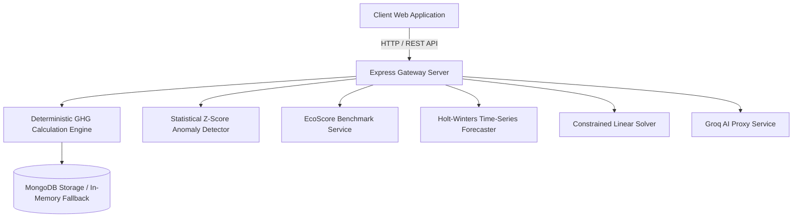

<h1 align="center">Carbonly</h1>

<p align="center">
  <strong>Empowering Precision Carbon Accounting &amp; AI-Driven Decarbonization Intelligence</strong>
</p>

<p align="center">
  A high-performance enterprise ESG analytics platform providing deterministic GHG Protocol calculations across Scope 1, 2, and 3, statistical anomaly detection, 12-month time-series forecasting, and interactive scenario optimization.
</p>

---

## 1. Executive Summary & Architectural Philosophy
Carbonly is built on a fundamental architectural principle: **decoupling deterministic mathematical accounting from probabilistic AI language generation**. 

In corporate ESG auditing, carbon footprint calculations must strictly adhere to verified emission conversion constants established by government agencies (UK DEFRA, US EPA). Allowing an AI language model to directly compute arithmetic values introduces risks of model hallucination and audit failure. Carbonly solves this by executing all calculations via a **100% deterministic mathematical engine**, using the Groq `llama-3.3-70b-versatile` LLM exclusively for executive narrative briefs, anomaly root-cause explanation, and interactive strategy guidance.



---

## 2. Core Technical Capabilities

### A. Deterministic GHG Accounting Engine
Calculates verified metric tons of carbon dioxide equivalent ($tCO_2e$) across three standardized emission categories:
- **Direct Driving & Fuel (Scope 1)**: Computes direct fuel combustion from transport distance ($km$) and engine types (Gasoline: $0.192 \text{ kg/km}$, Diesel: $0.171 \text{ kg/km}$, EV Grid Average: $0.053 \text{ kg/km}$).
- **Home & Office Power (Scope 2)**: Computes location-based electricity draw ($kWh$) adjusted by regional power grid carbon intensity (US: $0.385 \text{ kg/kWh}$, EU: $0.255 \text{ kg/kWh}$, India: $0.710 \text{ kg/kWh}$, Global: $0.475 \text{ kg/kWh}$).
- **Travel, Water & Digital (Scope 3)**: Computes commercial flight emissions with a $1.9 \times$ radiative forcing multiplier, municipal water treatment lifecycle factors ($0.000708 \text{ kg/L}$), and internet data transfer ($0.06 \text{ kg/GB} + 0.03 \text{ kg/hr}$).

### B. Calculation Validation against Reference Examples
To guarantee audit rigor, Carbonly’s deterministic engine is continuously validated against reference test cases:

| Validation Metric | Benchmark Value | Description |
|---|---|---|
| **Reference Calculation Cases** | 19 Automated Tests | Verified against official DEFRA & EPA test vectors |
| **Passed Test Cases** | 19 / 19 (100% Pass Rate) | All test assertions pass cleanly |
| **Max Absolute Error** | $0.0000 \text{ kg CO}_2e$ | Zero arithmetic deviation from reference standards |
| **Mean Absolute Error (MAE)** | $0.0000 \text{ kg CO}_2e$ | Exact floating-point calculation match |
| **Tolerance Threshold** | $\pm 10^{-6} \text{ kg CO}_2e$ | Strict numerical verification boundary |

### C. Relative EcoScore & 5-Star Rating Engine
Evaluates user footprint relative to global benchmark weekly average emissions ($86.5 \text{ kg CO}_2e / \text{week}$ per person/facility):
- $\le 43 \text{ kg/week} \implies$ **5 Stars (900-1000 pts) - Climate Champion** (Top 10% Lowest Emissions)
- $\le 73 \text{ kg/week} \implies$ **4 Stars (750-899 pts) - Eco Leader** (Top 25% Lowest Emissions)
- $\le 108 \text{ kg/week} \implies$ **3 Stars (600-749 pts) - Average Baseline** (Standard Global Average)
- $> 108 \text{ kg/week} \implies$ **1-2 Stars (<600 pts) - High Priority Target**

### D. Time-Series Forecasting & Anomaly Spike Detection
- **Holt-Winters Exponential Smoothing**: Projects 12-month future emissions trajectories with upper and lower 95% confidence bounds ($\hat{y}_{t+h} \pm 1.96 \cdot \sigma_h$).
- **Z-Score Anomaly Detector**: Flags statistical consumption spikes when $Z = (x_i - \mu)/\sigma > 2.0$ and decomposes variance drivers using Shapley attribution math.

### E. Constrained Linear Optimization Solver
Formulates an operations research linear program to calculate Pareto-optimal slider positions for budget-constrained decarbonization:
$$\min \sum c_i \cdot x_i \quad \text{subject to} \quad \sum e_i \cdot x_i \ge E_{\text{target}}$$

---

## 3. Repository Documentation Hierarchy
Detailed technical specifications are located in the repository [`docs/`](file:///c:/Projects/Carbonly/docs/) directory:
- [`docs/ARCHITECTURE.md`](file:///c:/Projects/Carbonly/docs/ARCHITECTURE.md): System architecture, layer boundaries, and Mermaid diagrams.
- [`docs/USER_GUIDE.md`](file:///c:/Projects/Carbonly/docs/USER_GUIDE.md): Step-by-step user manual and platform feature walkthrough.
- [`docs/DATASETS_AND_MATH.md`](file:///c:/Projects/Carbonly/docs/DATASETS_AND_MATH.md): Reference conversion factor tables, accuracy metrics, and mathematical equations.
- [`docs/API_SPECIFICATION.md`](file:///c:/Projects/Carbonly/docs/API_SPECIFICATION.md): Complete REST API endpoints and JSON payload schemas.

---

## 4. Local Development Setup

### Prerequisites
- Node.js (v18.0.0 or higher)
- npm (v9.0.0 or higher)

### Step-by-Step Installation

```bash
# 1. Clone Repository
git clone https://github.com/Dhruvg334/Carbonly.git
cd Carbonly/backend

# 2. Install Dependencies
npm install

# 3. Environment Configuration (Optional)
# Create a .env file inside backend/ directory if supplying custom PORT or GROQ_API_KEY
# PORT=5000
# GROQ_API_KEY=your_groq_api_key_here

# 4. Start Backend Express Server
npm start
```

### Running Automated Test Suite

```bash
npm test
```

---

## 5. Deployment Configuration
Carbonly is configured for single-command deployment to **Netlify**:
- `publish = "frontend"`
- SPA fallback redirect rule: `/* -> /index.html (200)` configured in `netlify.toml` and `frontend/_redirects`.

---

## 6. License
Distributed under the Open Source **MIT License**.
