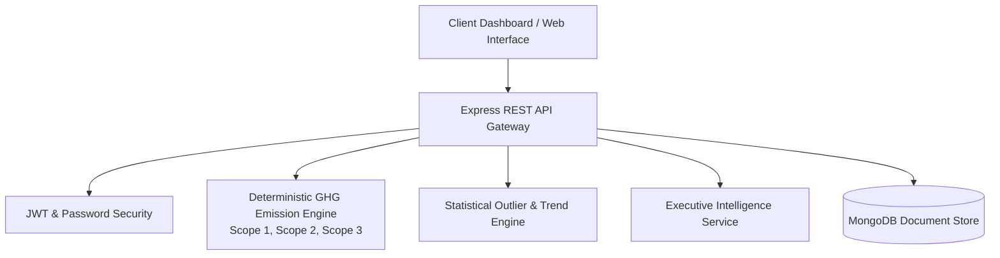

<h1 align="center">Carbonly</h1>
<p align="center">
  <b>Enterprise ESG & Decarbonization Intelligence Platform</b>
</p>

<p align="center">
  A high-performance carbon accounting platform providing deterministic GHG Protocol calculations, statistical anomaly detection, interactive decarbonization scenario modeling, and automated executive intelligence.
</p>

---

## Overview

Carbonly is an end-to-end sustainability analytics application designed to measure, analyze, and optimize greenhouse gas (GHG) emissions across personal, operational, and organizational activity streams.

Unlike traditional estimation tools, Carbonly enforces deterministic calculation standards aligned with global accounting standards (**GHG Protocol Corporate Standard**, **DEFRA**, and **EPA** emission factor datasets), paired with real-time scenario simulation and statistical outlier detection.

---

## System Architecture

The application is structured as a decoupled multi-tier system separating deterministic calculation engines, analytical processing, persistent storage, and interactive visualization interfaces.



---

## Key Technical Features

### 1. Deterministic Carbon Engine (Scope 1, 2, & 3)
- **Scope 1 (Direct Emissions)**: Fleet transport mileage, direct fuel combustion, heating.
- **Scope 2 (Indirect Emissions)**: Purchased electricity adjusted for regional grid carbon intensity factors.
- **Scope 3 (Value Chain Emissions)**: Commercial flights (with radiative forcing adjustments), water supply/wastewater lifecycle, digital data transfer, and equipment screen usage.

### 2. Statistical Anomaly & Trend Analytics
- Automated detection of historical consumption spikes using rolling Z-score and Interquartile Range (IQR) statistical algorithms.
- Historical time-series logging to track progression toward target reduction benchmarks.

### 3. Interactive "What-If" Decarbonization Simulator
- Real-time client-side sensitivity engine evaluating fleet electrification, renewable power purchase agreements (PPAs), and lifestyle adjustments.
- Instant quantification of metric tons ($tCO_2e$) avoided alongside financial cost impact estimates.

### 4. Executive Intelligence Summaries
- Context-aware narrative generation synthesizing emissions metrics, category drivers, and prioritized mitigation roadmaps.

---

## Technology Stack

### Frontend Application
- **Framework**: Vite, React, JavaScript (ES6+)
- **Styling & Design System**: Neo-Brutalist CSS Architecture, TailwindCSS
- **Visualizations & 3D Graphics**: Three.js, Recharts, Chart.js, Framer Motion
- **Deployment Target**: Netlify (Global CDN)

### Backend API
- **Runtime & Gateway**: Node.js, Express.js
- **Authentication**: JSON Web Tokens (JWT), bcrypt password hashing
- **Database ORM**: MongoDB, Mongoose
- **Validation & Security**: Environment secret isolation, CORS enforcement

---

## Installation & Setup

### Prerequisites
- Node.js (v18.0.0 or higher)
- npm (v9.0.0 or higher)
- MongoDB instance (Local or MongoDB Atlas URI)

### Backend Setup

1. Navigate to the backend directory:
```bash
cd backend
```

2. Install dependencies:
```bash
npm install
```

3. Configure environment variables in `.env`:
```env
PORT=5000
MONGO_URI=mongodb://localhost:27017/carbonly
JWT_SECRET=your_secure_jwt_secret_key
RESET_TOKEN_SECRET=your_secure_reset_secret_key
GROQ_API_KEY=your_groq_api_key
```

4. Start the development server:
```bash
npm start
```

The API server will run at `http://localhost:5000`.

### Frontend Setup

1. Navigate to the frontend directory:
```bash
cd frontend
```

2. Install dependencies (if applicable):
```bash
npm install
```

3. Launch the development server:
```bash
npm run dev
```

---

## API Specifications

| Method | Endpoint | Description | Auth Required |
| :--- | :--- | :--- | :--- |
| `POST` | `/api/register` | Registers a new user account | No |
| `POST` | `/api/login` | Authenticates credentials and returns JWT | No |
| `POST` | `/api/carbon/calculate` | Computes Scope 1/2/3 emissions from activity metrics | Yes |
| `GET` | `/api/carbon/history` | Fetches historical emissions entries for authenticated user | Yes |
| `DELETE`| `/api/carbon/history` | Clears historical activity entries | Yes |
| `POST` | `/api/carbon/simulate` | Executes sensitivity analysis for scenario parameters | Yes |

---

## Code Quality & Engineering Standards

This repository adheres to strict software engineering practices:
- **No Hardcoded Credentials**: Secrets and configuration parameters are loaded via environment variables.
- **Deterministic Calculation Integrity**: Financial and carbon accounting formulas are strictly isolated from non-deterministic logic.
- **Performance Constraints**: UI transitions are restricted to GPU-accelerated properties (`transform`, `opacity`) under 250ms execution times.

---

## Authors & Contributors

- **Dhruv Gupta** — System Architecture, Backend API & Security
- **Akshhaya Isa** — UI/UX Engineering & Frontend Visualizations
- **Shubhangini Mehta** — Carbon Accounting & Analytical Research

---

## License

This project is open-source software licensed under the [MIT License](LICENSE).

---

<p align="center">
  <i>Building verifiable technology for a sustainable future.</i>
</p>
