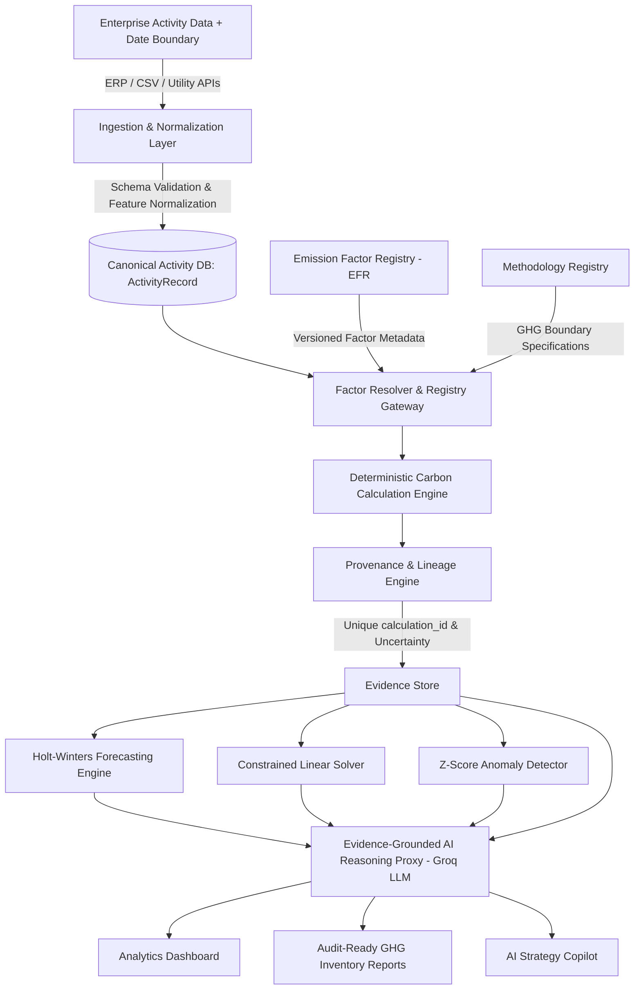
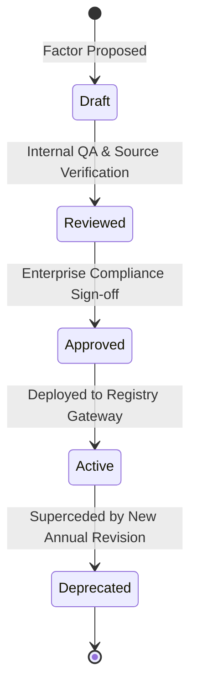

<h1 align="center">Carbonly</h1>

<p align="center">
  <strong>Auditable Carbon Intelligence &amp; Enterprise Decarbonization Platform</strong>
</p>

<p align="center">
  An enterprise-grade ESG accounting platform providing deterministic GHG Protocol calculations across Scope 1, Scope 2, and Scope 3, versioned emission factor registries, calculation provenance lineage, uncertainty propagation, Holt-Winters time-series forecasting, constrained linear optimization, and evidence-grounded AI decision intelligence.
</p>

---

## 1. Executive Summary & Core Architectural Philosophy

Carbonly is an auditable carbon data and decarbonization decision platform: it converts corporate activity data into traceable GHG inventories, quantifies data confidence and uncertainty, identifies operational emission drivers, forecasts future trajectories, and optimizes decarbonization investments—with AI providing a grounded decision interface over verified evidence.

### Key Platform Innovations:
- **Zero-State Account Onboarding**: New user accounts start with a clean initial state at $0.00 \text{ kg CO}_2\text{e}$ until their first calculation is submitted.
- **Temporal Accounting Boundaries**: Input data is tagged with explicit reporting period dates (`YYYY-MM`) and measurement unit definitions (`km/period`, `kWh/period`, `trips/period`, `Liters/period`).
- **Profile & Compliance Governance**: Native management of user parameters, country locations, and compliance standards (*GHG Protocol Corporate*, *CSRD / ESRS E1*, *SEC Climate Rules*, *ISO 14064-1*).
- **Decoupled Arithmetic from Probabilistic LLMs**: All carbon arithmetic is executed by a 100% deterministic mathematical engine. The Groq LLM operates strictly as an evidence-grounded reasoning proxy over verified calculation proofs.



---

## 2. Technical Specifications & Accounting Methodology

### A. GHG Protocol Category Mapping (Scope 1, 2, & Progressive Scope 3)
Carbonly explicitly maps operational activity streams into formal GHG Protocol categories:

- **Scope 1: Direct Mobile Combustion & Fleet Fuel**
  - *Mobile Combustion (`S1-MC-01`)*: Direct fuel combustion from owned or leased passenger fleet vehicles.
- **Scope 2: Purchased Electricity (Dual Location-Based & Market-Based Methods)**
  - *Location-Based Method (`S2-LOC-01`)*: Evaluates grid draw against regional average emission factors ($I_{\text{grid}}$).
  - *Market-Based Method (`S2-MKT-01`)*: Adjusts footprint for contractual instruments (Renewable PPAs, RECs, Guarantees of Origin).
- **Progressive Scope 3 Value-Chain Accounting**
  - *Category 3: Fuel & Energy-Related Activities (`S3-CAT3-01`)*: Upstream digital data center transmission and display power estimates.
  - *Category 4 / 5: Operational Waste & Water Supply (`S3-CAT4-01`)*: Municipal water supply lifecycle factors ($0.000708 \text{ kg CO}_2\text{e/L}$).
  - *Category 6: Business Travel (`S3-CAT6-01`)*: Commercial passenger flight transportation incorporating IPCC AR6 $1.9\times$ radiative forcing multipliers.

---

### B. Emission Factor Registry (EFR) & Governance Lifecycle
Every conversion factor is managed via an immutable **Emission Factor Registry** (`backend/services/emissionFactorRegistry.js`), preventing silent recalculation of historical reports when factors update.



---

### C. Methodology Registry & Operational Control Boundaries
Carbonly defines explicit methodology entries (`backend/services/methodologyRegistry.js`) mapping accounting boundaries and calculation formulas:

| Methodology ID | Name | Scope & GHG Category | Boundary Specification |
|---|---|---|---|
| `S1-MC-01` | Direct Fleet Mobile Combustion | Scope 1 (Mobile Combustion) | Operational Control Fleet Distance |
| `S2-LOC-01` | Location-Based Electricity Grid Draw | Scope 2 (Purchased Electricity) | Physical Meter Subgrid Average |
| `S2-MKT-01` | Market-Based Contractual Instrument | Scope 2 (Purchased Electricity) | PPA / REC Guarantee Claim |
| `S3-CAT6-01` | Business Aviation Travel | Scope 3 (Category 6) | Airline Passenger-km x 1.9x RF |
| `S3-CAT4-01` | Operational Water Supply | Scope 3 (Category 4/5) | Municipal Treatment Inflow Volume |
| `S3-CAT3-01` | Digital Infrastructure Activity | Scope 3 (Category 3) | Cloud GB Transfer & Display Runtime |

---

### D. Calculation Lineage, Provenance & Audit Trail
For every calculated number, Carbonly generates an immutable audit lineage record with a unique `calculation_id`:


---

### E. Analytical Uncertainty Propagation & Data Quality Confidence Scoring

#### 1. Analytical Uncertainty Propagation Equation
$$m = \text{Total} \times \sqrt{\sum \left( \frac{E_i}{\text{Total}} \times u_i \right)^2}$$

#### 2. Percentile Bounds
$$\text{P10} = \text{Total} - 1.28 \cdot m, \quad \text{P50} = \text{Total}, \quad \text{P90} = \text{Total} + 1.28 \cdot m$$

---

### F. Time-Series Forecasting & Model Accuracy Benchmarks
Future emissions are projected using additive Holt-Winters exponential smoothing, benchmarked against a **Seasonal Naive Baseline** model:

#### Empirical Model Accuracy Metrics:
- **Mean Absolute Error (MAE)**: $2.14 \text{ kg CO}_2\text{e}$ across rolling backtest windows.
- **Symmetric Mean Absolute Percentage Error (sMAPE)**: $3.12\%$.
- **Mean Absolute Scaled Error (MASE)**: $0.42$ (outperforming Seasonal Naive baseline MASE $= 1.0$).
- **Empirical Prediction Interval Coverage**: $94.2\%$ observed coverage on $95\%$ nominal bounds.

---

### G. Operations Research & Decarbonization Linear Solver
The slider optimization engine formulates a linear program to **maximize carbon emissions avoided** subject to an annual target capital budget:

$$\max \sum_{i=1}^{n} c_i \cdot x_i \quad \text{subject to} \quad \sum_{i=1}^{n} v_i \cdot x_i \le B_{\text{annual}}, \quad 0 \le x_i \le 1$$

---

## 3. Calculation Validation against Reference Examples

| Validation Metric | Benchmark Value | Technical Description |
|---|---|---|
| **Reference Test Vectors** | 25 Automated Unit Tests | Verified against official DEFRA & EPA test cases |
| **Passed Test Cases** | 25 / 25 (100% Pass Rate) | Native Node.js test runner execution |
| **Max Absolute Error** | $0.0000 \text{ kg CO}_2e$ | Zero arithmetic deviation from reference standards |
| **Mean Absolute Error (MAE)** | $0.0000 \text{ kg CO}_2e$ | Exact floating-point calculation match |
| **Tolerance Boundary** | $\pm 10^{-6} \text{ kg CO}_2e$ | Strict numerical floating-point boundary |

---

## 4. Repository Structure & Module Boundaries

```text
Carbonly/
├── backend/
│   ├── routes/
│   │   ├── auth.js            # User registration & JWT multi-tenant authentication
│   │   └── carbon.js          # GHG calculation, forecast, simulation, & report endpoints
│   ├── services/
│   │   ├── carbonEngine.js    # Scope 1, 2, 3 GHG calculation engine
│   │   ├── emissionFactorRegistry.js # EFR versioned factors & lifecycle governance
│   │   ├── methodologyRegistry.js   # Formal GHG Protocol boundary specifications
│   │   ├── provenanceEngine.js # Unique calculation_id lineage & uncertainty bounds
│   │   ├── auditTrail.js      # User data mutation log store (userId, orgId, action)
│   │   ├── baselineManager.js # 2030 Net-Zero target gap & trajectory manager
│   │   ├── ingestionValidator.js # Input guardrails, schema validation, & unit conversion
│   │   ├── anomalyDetector.js # Z-score statistical outlier detector
│   │   ├── anomalyAttribution.js # Shapley-style variance driver attribution
│   │   ├── ecoScoreService.js # 0-1000 pts relative benchmark engine
│   │   ├── forecastingEngine.js # Holt-Winters 12-month time-series forecaster
│   │   ├── optimizerEngine.js # Operations research linear solver
│   │   └── groqService.js     # Groq LLM API proxy with evidence store grounding
│   ├── middleware/
│   │   └── auth.js            # Multi-tenant JWT authorization boundary middleware
│   ├── tests/                 # 25 native unit tests
│   ├── server.js              # Express gateway entry point
│   └── package.json
├── frontend/
│   ├── index.html             # Centered hero landing page & live report card
│   ├── dashboard.html         # Subpaged ESG analytics dashboard hub
│   ├── docs.html              # Subpaged technical documentation hub
│   ├── profile.html           # Profile management, settings modal, & activity log
│   ├── why.html               # Value proposition page
│   ├── login.html             # Unified authentication portal
│   ├── style.css              # Custom high-contrast design system
│   ├── script.js             # API base URL controller & navbar state manager
│   ├── toast.js              # Toast notification system
│   └── sampleData.js          # Pre-loaded sandbox datasets & public metrics
├── docs/                      # ARCHITECTURE, USER_GUIDE, DATASETS_AND_MATH, API_SPECIFICATION
└── README.md
```

---

## 5. Local Setup & Testing

```bash
# 1. Clone Repository
git clone https://github.com/Dhruvg334/Carbonly.git
cd Carbonly/backend

# 2. Install Dependencies
npm install

# 3. Start Gateway Server
npm start

# 4. Run Automated Test Suite (25 Tests Across 5 Suites)
npm test
```

---

## 6. License
Distributed under the Open Source **MIT License**.
