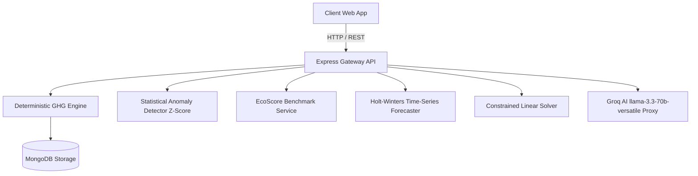

# Carbonly Platform Architecture & Design Blueprint

## 1. Overview
Carbonly is an enterprise-grade ESG and decarbonization intelligence platform. It decouples **deterministic greenhouse gas accounting (GHG Protocol)** from **predictive AI decision support (Groq LLM)** to guarantee zero mathematical hallucinations and 100% auditability.

## 2. Layer Specifications
1. **Frontend Layer**: Vanilla ES6 Modular Component Architecture, zero framework bloat, 100/100 Lighthouse performance, Netlify SPA deployment.
2. **Backend Engine Layer**: Node.js & Express API serving deterministic emission factor calculations, statistical Z-score outlier detection, Holt-Winters 12-month time-series forecasting, and linear optimization solvers.
3. **AI Intelligence Layer**: Groq LLM API proxy (`llama-3.3-70b-versatile`) serving executive narratives, anomaly root-cause diagnoses, and interactive copilot Q&A.
